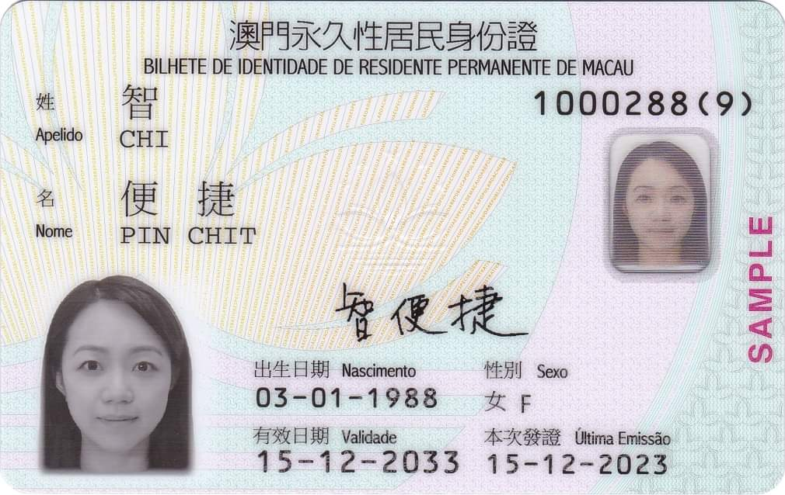
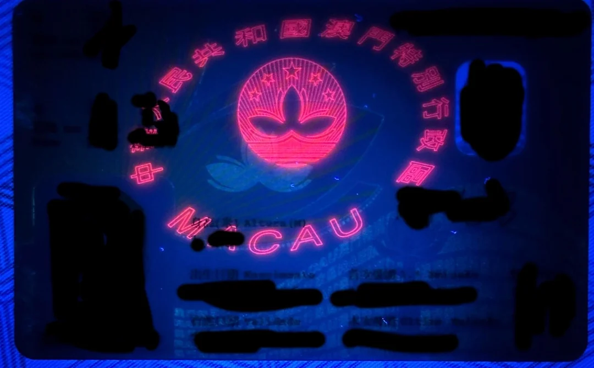
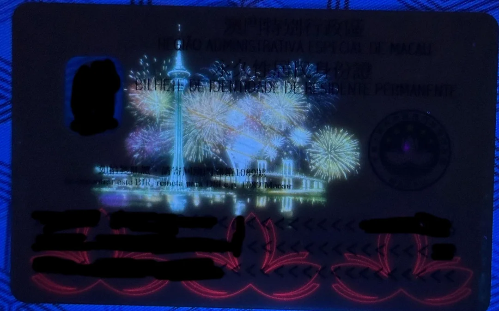
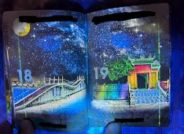
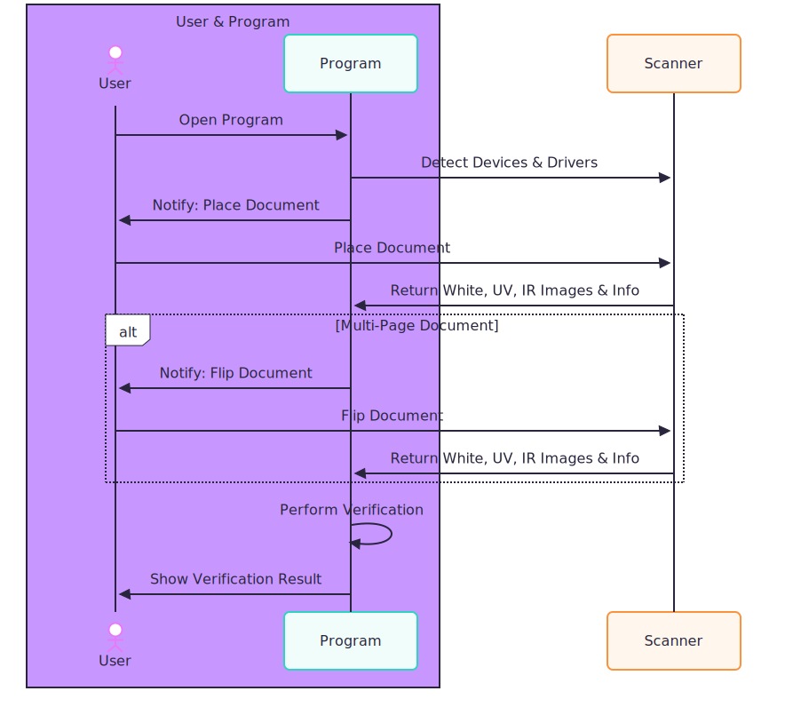

::github{repo="shimat/opencvsharp"}

# Series

- [Part 1](./part1.md) : Just simply talk about ideas what we needed to build a identification system
- [Part 2](./part2.md) : The database schema design.
  :::Tip
  in part1 we just small talk about our idea how we implementing the idcentication system
  :::

# Motivation

Developing a robust identification system is crucial for industries such as security, banking, and border control. These systems automate the verification of identity documents like ID cards and passports, enhancing efficiency and reducing human error. By leveraging OpenCV's powerful image processing capabilities, we can create a solution that accurately detects and validates key features of identification documents, ensuring secure and reliable authentication.

## Background knowledge of Id Card And Passport

ID cards and passports are critical for identity verification, incorporating advanced security features to prevent forgery. For instance, Macau ID cards include holographic elements, microtext, and UV-reactive patterns. To check authenticity, systems analyze these features under specific lighting conditions or use machine-readable zones (MRZ) for data extraction. Techniques like pattern matching and optical character recognition (OCR) in OpenCV help verify details such as serial numbers, barcodes, or embedded chips, ensuring the document is genuine.


## UV Id card

front page under UV light

back page under UV light


## UV passport

passport under UV light



## MRZ In IdCard

The Machine-Readable Zone (MRZ) is a standardized section on ID cards and passports, typically consisting of two lines of text in a fixed-width font. For ID cards, like the Macau ID, the MRZ encodes essential information such as the holder's name, document number, nationality, date of birth, and expiration date. This data is formatted according to international standards (e.g., ICAO Doc 9303), ensuring compatibility with automated systems worldwide. The MRZ's structured layout allows OpenCV-based systems to use OCR to extract data reliably, even under varying image conditions. By verifying the MRZ's check digits and cross-referencing with other document features, such as UV patterns or embedded chips, the system can confirm the ID's authenticity, making it a cornerstone of secure identification.

# System Design



1. **User Interaction**: The user opens the program, which detects connected scanners and drivers.
2. **Document Scanning**: The program prompts the user to place the document in the scanner. The scanner captures White, UV, and IR images.
3. **Multi-Page Handling**: If the document has multiple pages, the program notifies the user to flip the document for additional scans.
4. **Image Processing and Verification**: The program preprocesses and post-processes images, identifies the document type, performs zone-based analysis, and validates authenticity.
5. **Result Display**: The verification result is shown to the user, typically as a score or pass/fail status.

# Image Process Design


The system processes images to determine document validity. Below is the flow in pseudocode:

```plaintext
if image is not >= 80% black then
    preprocess image (rotate, scale, color normalization)
    postprocess image (cut into zones, label zone types)
    identify document type
    for each zone:
        retrieve processing method from database (template matching, color space hashing, or feature detection)
        apply method and assign step scores
    sum step scores to calculate final verification score
```

# OCR

Reading Image Text , we may choose **PaddleOCR** or **Tessert** or some other , not that important

## Image Processing with OpenCV

### Preprocessing

- **Rotate**: Align the document using edge detection (e.g., Hough Transform).
- **Scale**: Resize to a standard resolution for consistent processing.
- **Color Normalization**: Adjust brightness and contrast for White, UV, and IR images to standardize output across scanners.

### Postprocessing

- **Zone Cutting**: Segment the image into predefined zones (e.g., VISUAL, BARCODE, MRZ, RFID, MAGSTRIPE).
- **Processing Methods**: Retrieve methods from the database:
  - **Template Matching**: Compare zones with known templates using normalized cross-correlation.
  - **Color Space Hashing**: Hash images in YCrCb color space for comparison.
  - **Feature Detection**: Use algorithms like SIFT or ORB to identify key points.

#### Feature Extraction

Feature extraction involves detecting and describing key points (features) in an image for tasks like object recognition, image matching, or 3D reconstruction. OpenCV provides several algorithms for feature detection and description:

- **SIFT (Scale-Invariant Feature Transform)**:

  - **Description**: Detects and describes keypoints that are invariant to scale, rotation, and partially invariant to illumination changes. It computes a 128-dimensional descriptor for each keypoint.
  - **Usage**: Suitable for robust feature matching in varied conditions.
  - **OpenCV Function**: `cv2.SIFT_create()` (available in OpenCV's `xfeatures2d` module in older versions or main module in newer versions).

- **SURF (Speeded-Up Robust Features)**:

  - **Description**: A faster alternative to SIFT, using integral images and Haar wavelet responses for keypoint detection and description. It provides a 64- or 128-dimensional descriptor.
  - **Usage**: Useful for real-time applications due to speed.
  - **OpenCV Function**: `cv2.xfeatures2d.SURF_create()` (available in `xfeatures2d` module, requires OpenCV contrib).

- **ORB (Oriented FAST and Rotated BRIEF)**:

  - **Description**: Combines FAST keypoint detector and BRIEF descriptor, adding orientation information. It is computationally efficient and provides binary descriptors.
  - **Usage**: Ideal for resource-constrained environments like mobile devices.
  - **OpenCV Function**: `cv2.ORB_create()`.

- **BRIEF (Binary Robust Independent Elementary Features)**:

  - **Description**: A descriptor-only method that creates binary strings by comparing pixel intensities in a patch around a keypoint. Typically paired with a detector like FAST.
  - **Usage**: Fast descriptor computation for matching.
  - **OpenCV Function**: `cv2.xfeatures2d.BriefDescriptorExtractor_create()` (requires `xfeatures2d`).

- **FAST (Features from Accelerated Segment Test)**:

  - **Description**: A keypoint detector that identifies corners by comparing a pixel with its neighbors in a circular pattern. It does not include a descriptor.
  - **Usage**: High-speed detection, often paired with BRIEF or ORB.
  - **OpenCV Function**: `cv2.FastFeatureDetector_create()`.

- **Harris Corner Detector**:

  - **Description**: Detects corners based on intensity changes in a local window, using the Harris corner response function.
  - **Usage**: Good for detecting stable corners but lacks scale invariance.
  - **OpenCV Function**: `cv2.cornerHarris()`.

- **BRISK (Binary Robust Invariant Scalable Keypoints)**:
  - **Description**: Combines a scale-space pyramid for keypoint detection with a binary descriptor, similar to ORB but with different scale handling.
  - **Usage**: Robust for scale and rotation changes, efficient for matching.
  - **OpenCV Function**: `cv2.BRISK_create()`.

#### Template Matching

Template matching involves sliding a template image over a source image to find regions of similarity. OpenCV provides several methods for template matching, all implemented in the `cv2.matchTemplate()` function with different similarity measures:

- **Squared Difference (TM_SQDIFF)**:

  - **Description**: Computes the sum of squared differences between the template and the image patch. Lower values indicate better matches.
  - **Usage**: Sensitive to intensity differences, good for exact matches.

- **Normalized Squared Difference (TM_SQDIFF_NORMED)**:

  - **Description**: Normalizes the squared difference to account for intensity variations, making it more robust.
  - **Usage**: Better for varying lighting conditions.

- **Correlation (TM_CCORR)**:

  - **Description**: Computes the correlation between the template and image patch. Higher values indicate better matches.
  - **Usage**: Sensitive to intensity scaling, less robust to lighting changes.

- **Normalized Correlation (TM_CCORR_NORMED)**:

  - **Description**: Normalizes the correlation to reduce sensitivity to intensity changes.
  - **Usage**: More robust for lighting variations.

- **Correlation Coefficient (TM_CCOEFF)**:

  - **Description**: Computes the correlation coefficient, subtracting the mean of the template and image patch.
  - **Usage**: Robust to linear intensity changes.

- **Normalized Correlation Coefficient (TM_CCOEFF_NORMED)**:
  - **Description**: Normalizes the correlation coefficient for robustness to lighting and contrast changes.
  - **Usage**: Most robust for varying conditions, widely used.

## Possible ID Card Zones

- **VISUAL**: Logos, photos, or holograms.
- **BARCODE**: QR codes or barcodes for encoded data.
- **MRZ**: Machine-readable zone for passports/ID cards, varying by country.
- **RFID**: Embedded chip data (if supported by scanner).
- **MAGSTRIPE**: Magnetic stripe data (if applicable).

## Scanner Output

Scanners produce:

- **White Image**: Visible light scan for text and visual elements.
- **Infrared (IR) Image**: Highlights security features like IR ink.
- **Ultraviolet (UV) Image**: Reveals fluorescent patterns or overlays.

### Supported Hardware

Example scanners include:

- AssureTec_ID150,
- **AT9000MK2**,
- AT10Ki,
- ISI221,
- **AT9000MK1**,
- AT10K,
- KR9000,
- QS1000,
- Desko_ID1Go,
- HaSoInTech_ID600S,
- AssureTec_ID1501,
- CR5400,
- IST220,
- IST221,
- ISI300,
- ISI222,
- Regula_72X3,
- Regula_70X4M,
- Regula_70X7,
- Witek_XID100,
- ESeek_M500,
- Desko_Penta,
- Desko_Icon,
- AccessIS_ATOM,
- AccessIS_ADR100,

### Example Driver

- **3M AT9000**: A common scanner driver for capturing White, UV, and IR images.

## Verification Steps

Each step outputs a score, contributing to the final verification ratio:

- **PatternMatch**: Template matching for known patterns.
- **Presence**: Check for expected elements (e.g., hologram).
- **UVOverlay**: Validate UV-specific overlays.
- **CrossMatch**: Compare data across White, UV, and IR images.
- **DataValidation**: OCR-based validation of MRZ, country code, birthdate, expiry date, and age.
- **InvalidPattern**: Detect tampered or incorrect patterns.
- **NonPattern**: Identify missing expected patterns.

## Normalization for Scanner Output

- **IR Normalization**: Adjust for varying IR sensitivity across scanners (shifting, scaling, gamma correction).
- **UV Normalization**: Standardize UV fluorescence intensity.

## Template Matching and Feature Detection

- **Template Matching**: Use OpenCV’s `cv2.matchTemplate` in YCrCb color space for robust comparison.
- **Feature Detection**: Apply SIFT/ORB for keypoint matching in White, UV, and IR images.

## Data Validation

OCR extracts text from zones (e.g., MRZ) and validates:

- **MRZ**: Check format and checksum for country-specific standards.
- **Country Code, Birthdate, Expiry Date, Age**: Cross-verify with database or computed values.

## Authentication Tests

- **PatternMatch**: Match against stored templates.
- **UV_Presence/NonPresence**: Confirm UV elements.
- **FeatureDetection**: Validate keypoints.
- **UV_OverlayDetection**: Check UV-specific security features.
- **Invalid_Pattern_Detection**: Flag anomalies.

## Conclusion

This article covers the foundational design of an identification engine, focusing on scanner integration, image processing with OpenCV, and verification steps. Part 2 will dive deeper into implementing the image processing pipeline and handling edge cases.

# What's Next

We are going to design the db schema for our system in [Part 2](./part2.md) : The database schema design.
