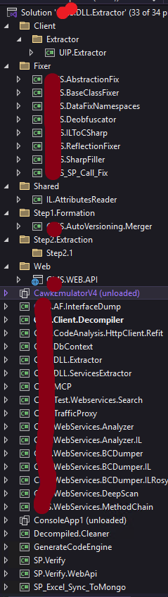

:::Caution
Disclaimer: This blog series is intended solely for educational purposes to share ideas and concepts related to my company system. The content provided, including any proof-of-concept (POC) code, is meant to illustrate ideas and foster learning. No full solutions or sensitive company details are included due to **privacy** and **security** considerations. The POC code shared is not intended for production use and should be treated as illustrative examples only. Readers are encouraged to adapt and expand upon these ideas responsibly, respecting all applicable privacy and security guidelines.
:::

:::Tip
In [Part 1](./part1.md), we dipped our toes into the shallow end of this series to keep things engaging and avoid overwhelming you with too much detail at once.
:::

# Series Overview

- [Part 1](./part1.md): Lay the foundation with essential knowledge for the journey ahead.
- [Part 2](./part2.md): Aggerating AF and BC Relationships, Dive into building our IL Parser for deeper system insights.
- [Part 3](./part3.md): Aggerating BC And Store Procedures Relations
- [Part 4](./part4.md): Dumping soap endpoints and domain models
- [Part 5](./part5.md): Generating C# code for RestFul Api.

# Prerequisites

To follow along, you'll need:

- **dnSpy**: For decompiling and analyzing .NET assemblies.
- **C# Development Kit**: Essential tools for coding and debugging.

# Background: Tackling Real-World Challenges

My daily work feels like navigating a labyrinth of complex, repetitive tasks that demand both technical finesse and unwavering patience. I'm currently wrestling with two formidable challenges: migrating a legacy SOAP-based system to a modern RESTful API and unraveling a massive, obfuscated codebase without access to its source. This is all part of a critical effort to streamline a large-scale system overhaul, where every step forward counts.
Finally , I wrote up **33** programs to do this system POC.

Including:

- **deobfuscator** - using de4dotlib to write custom **Cflow** remover aim for **dotobfuscator**
- **IL Parser** - using dnlib to parse the IL for AF , BC Layer
- **Rosyln Code Parser** - Legacy solution I will explain below section
- **Code Generation** - For generating restful api code using T4 Template.
- **MCP Tools** - for asking LLM to call API about extracted information

## Goals

- Extract over **3,000 Domain Models**, **100+ DbContexts**, and **1,000+ Stored Procedures** from the existing system.
- Build a robust RestFul API that encapsulates business logic instead of old **soap**.
- Visualize data flows for better understanding and future development.
- Estimate the effort required for a full system migration.
- Code Generation for Restful services

## High-Level System Overview

To grasp the big picture, we need to understand how the system interacts with peer systems. Here's a visual representation:

## Current Challenges

Migrating from SOAP to REST is like translating an ancient script into a modern language—it requires precision and a deep understanding of both systems. Meanwhile, decoding the codebase is akin to solving a puzzle with missing pieces, given its sheer size and obfuscation by **DotObfuscator**.

## Project Plan

To conquer these challenges, I've crafted a structured roadmap:

1. **Extract Domain Models**: Identify and pull all domain model classes from the codebase.
2. **Store in MongoDB**: Organize extracted models in MongoDB for efficient data management.
3. **Transform with MongoDB Pipelines**: Use MongoDB’s aggregation pipelines to process and refine the data.
4. **Integrate with VectorDB (Neo4j)**: Import transformed data into Neo4j for advanced querying and relationship mapping.
5. **Estimate Migration Effort**: Calculate the resources needed for a complete system transition.

## Pain Points

This project is fraught with obstacles:

1. **Massive Domain Model Count**: Over **3,000** domain models make extraction a Herculean task.
2. **Opaque Legacy Vendor Product**: The lack of accessible source code forces us to rely on creative reverse-engineering techniques.
3. **Obfuscation by DotObfuscator**: The codebase is heavily obfuscated, and manually extracting domains and business logic could take over **1,000 man-days**.

Before diving in, let’s gather insights into the frontend and backend components.

# Client-Side Insights

To understand the client, we’ll drag over **200+ DLLs** into **dnSpy** for analysis.

## Frontend Architecture

The client follows a clean **MVVM** (Model-View-ViewModel) pattern, keeping things modular and maintainable.

## Frontend Terminology

| Term  | Full Term              | Explanation                                                                                                                                                                  |
| ----- | ---------------------- | ---------------------------------------------------------------------------------------------------------------------------------------------------------------------------- |
| DA    | Domain Abstraction     | Represents business-specific logic and rules. Used as "DA" in code for brevity and "Domain Abstraction" in formal design discussions.                                        |
| SC    | Services Contract      | Defines service operations and data structures, often in a service-oriented architecture. "SC" is used in code, while "Services Contract" appears in detailed documentation. |
| BE    | Business Entity        | Encapsulates business data (e.g., Customer, Order). "BE" is used in code, while "Business Entity" is used in architectural discussions.                                      |
| Proxy | Soap Proxy Call        | Facilitates communication with external SOAP services. "Proxy" is used in code, while "Soap Proxy Call" is used in design documents.                                         |
| UIP   | User Interface Program | Manages user interface logic. "UIP" is used in codebases, while "User Interface Program" is used in broader discussions.                                                     |
| COM   | Component Object Model | Microsoft’s framework for native component integration. "COM" is used in technical contexts, while "Component Object Model" is used in formal documentation.                 |

# Server-Side Insights

Similarly, we’ll analyze the server by dragging service DLLs into **dnSpy**.

## Backend Architecture

## Backend Terminology

| Term  | Full Term                | Explanation                                                                                                                                                                                      |
| ----- | ------------------------ | ------------------------------------------------------------------------------------------------------------------------------------------------------------------------------------------------ |
| AF    | Application Facade       | Acts as the entry point for API subsets, orchestrating calls to Business Contracts (e.g., ServiceA.BC → ServiceB.BC). "AF" is used in code, while "Application Facade" is used in documentation. |
| BC    | Business Contract        | Encapsulates internal service logic with interdependencies (e.g., ServiceA.BC calls ServiceB.BC). "BC" is used in code, while "Business Contract" is used in design discussions.                 |
| AFBAT | Application Facade Batch | Extends or aggregates Application Facades for batch operations. "AFBAT" is used in code, while "Application Facade Batch" is used in documentation.                                              |
| OFFL  | Offline Storage          | Manages persistent data for offline scenarios. "OFFL" is used in technical contexts, while "Offline Storage" is used in specifications.                                                          |
| DA    | Domain Application       | Handles business-specific logic, consistent with the client. "DA" is used in code, while "Domain Application" is used in design documents.                                                       |
| BE    | Business Entity          | Represents business data (e.g., Customer, Order), consistent with the client. "BE" is used in code, while "Business Entity" is used in architectural discussions.                                |
| SC    | Services Contract        | Defines service interfaces, consistent with the client. "SC" is used in code, while "Services Contract" is used in documentation.                                                                |
| Proxy | Soap Proxy               | Facilitates SOAP-based communication, consistent with the client. "Proxy" is used in code, while "Soap Proxy" is used in design documents.                                                       |

# IL Parsing for Backend Analysis

To extract critical information, we’ll use **IL parsing** to analyze the **Application Facade (AF)**, identify **Business Contracts (BC)**, locate **DbContexts**, and extract **tables** and **stored procedure calls**. We’ll leverage **Kafka** as our message queue for efficient processing.

## Why IL Parsing Over Roslyn Syntax Trees?

From my experience, **Roslyn** syntax tree parsing is impractical for our needs due to:

- **Obfuscated Code**: We lack deobfuscated source code, and even clean code may not build successfully.
- **Resource Intensity**: Roslyn requires building the entire solution, loading it, and constructing syntax trees, which is time-consuming (e.g., my attempt with a custom **DotObfuscator** cleaner took around **4 hours**).
- **Scalability Issues**: Each Kafka consumer would need to clone and rebuild the project, slowing down the process.Also for resouces management is crictical if **Rosyln** open a solution with treeses each time.

In contrast, **IL parsing** offers:

- **Speed**: Reads metadata tables directly, taking just around **20 seconds** compared to hours with Roslyn.
- **Efficiency**: Enables parallel processing with Kafka consumers.
- **Simplicity**: Flow is straightforward—read IL metadata, store in Redis (or another database), and link references manually.

# Summary

This series is packed with complex tasks, so I’ve broken it down into manageable parts to keep it digestible and actionable.

# What’s Next?

In the next part, we’ll start coding the **IL Parser Consumer** to extract and process the critical data we need.
