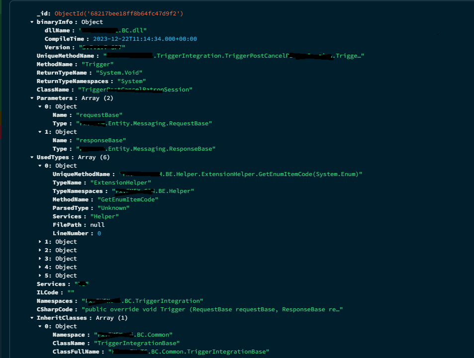
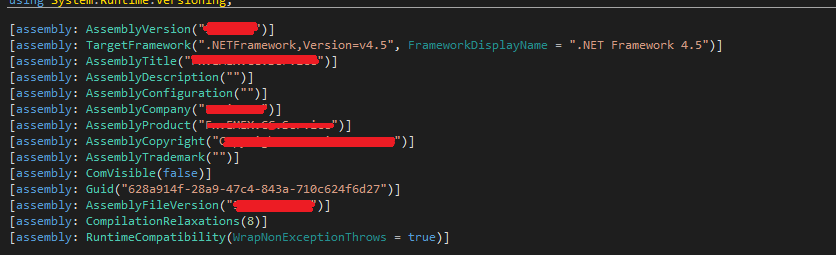
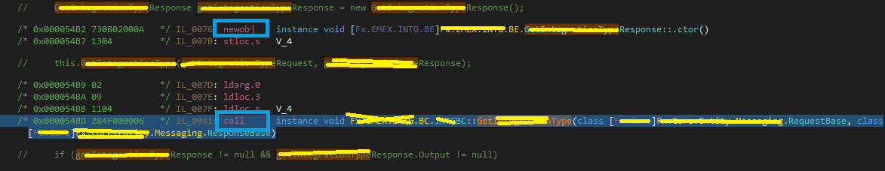
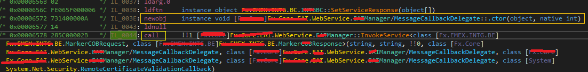
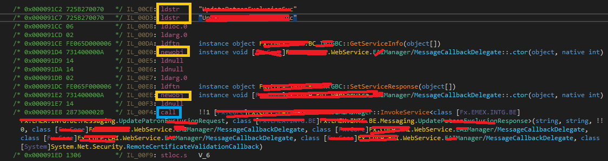
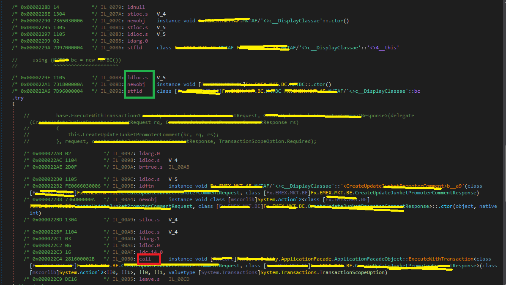

:::Caution
Disclaimer: This blog series is intended solely for educational purposes to share ideas and concepts related to my company system. The content provided, including any proof-of-concept (POC) code, is meant to illustrate ideas and foster learning. No full solutions or sensitive company details are included due to **privacy** and **security** considerations. The POC code shared is not intended for production use and should be treated as illustrative examples only. Readers are encouraged to adapt and expand upon these ideas responsibly, respecting all applicable privacy and security guidelines.
:::

# Series Overview

- [Part 1](./part1.md): Lay the foundation with essential knowledge for the journey ahead.
- [Part 2](./part2.md): Aggerating AF and BC Relationships, Dive into building our IL Parser for deeper system insights.
- [Part 3](./part3.md): Aggerating BC And Store Procedures Relations

# Unraveling System Insights: Parsing AF and BC Layers

Welcome back to our blog series, where we explore the technical underpinnings of our company’s system design. In this installment, we dive into the process of parsing the Intermediate Language (IL) to uncover relationships between the Application Framework (AF) and Business Components (BC) layers. If you missed the foundational concepts, check out [Part 1](./part1.md) for context. Let’s jump into the mechanics of building our IL Parser and understanding the system’s architecture.

Including:

- **deobfuscator** - using de4dotlib to write custom **Cflow** remover aim for **dotobfuscator**
- **IL Parser** - using dnlib to parse the IL for AF , BC Layer
- **Rosyln Code Parser** - Legacy solution I will explain below section
- **Code Generation** - For generating restful api code using T4 Template.
- **MCP Tools** - for asking LLM to call API about extracted information

## System Design Recap


Our system revolves around a directory scanner that identifies target DLLs or executables by analyzing their metadata. Each consumer container synchronizes application files for processing. The core components include:

:::CAUTION
It is not recommend to fillin large buffer for Kafka EventMessage for futher information please check.
:::
Since the Kafka and Mongo parts are quite simple for daily work , we mainly focus on how the system build.

# Goal

- Extract the relationship between AF and BC layers

# Understanding AF,BC Layers


The system workflow begins with the AF (Soap Endpoint), labeled as OrderProcessingAPI, which serves as the entry point. The AF initiates three BCs (Business Components): OrderManager, InventoryService, and PaymentProcessor. Each BC interacts with specific SPs (Stored Procedures) or RSs (Remote Services). The OrderManager (BC) queries two SPs, ValidateOrder and UpdateOrderStatus, and calls one RS, CustomerProfile. The InventoryService (BC) queries one SP, CheckStock, and calls one RS, WarehouseSync. The PaymentProcessor (BC) queries one SP, ProcessPayment, and calls two RSs, PaymentGateway and FraudCheck. In the diagram, the AF is colored blue, BCs are green, RSs are red, and SPs are yellow, with components grouped into Business Components and Data & Services sections for clarity.

## Schema Design


We created simple code schema in **MongoDB** for staging our parsed info for BC and AF
To stage parsed data, we designed a MongoDB schema to capture relationships between AF and BC layers:

- **id**: ObjectId
- **binaryInfo**: Object containing:
  - _dlName_: String (DLL name)
  - _completionTime_: ISODate (compilation timestamp)
  - _version_: String (assembly version)
  - _uniqueMethodId_: String (unique method identifier)
- **methodName**: String
- **returnTypeName**: String
- **returnTypeNamespaces**: Array of Strings
- **className**: String
- **parameters**: Array of objects, each detailing:
  - _name_: String
  - _type_: Object with _uniqueMethodName_, _typeName_, _typeNamespaces_, _methodName_, _parsedType_, _services_, _filePath_, and _lineNumber_
- **ILCode**: String
- **namespaces**: Array of objects with _nameSpace_, _className_, and _classFullName_

This schema mirrors an employee table, where _parsedType_ acts like a _sub_role_, enabling recursive scanning from AF to BC layers. A unique C# token is constructed using _assemblyName + namespaces + className + returnType + methodName + parameters_.

## Querying the Schema

We employ a recursive pipeline to query the schema. While MongoDB serves our needs, PostgreSQL could offer superior performance for complex queries.
:::Tips
In fact , MongoDB doesnt do a great job , PostgresSql may do a better job instead
:::

## IL Parsing: The Core Process

The IL parsing process begins with metadata extraction using **dnlib** and C# reflection.

### Load Related Modules

Since it is impossible to loading all related assemblies into memory , there should be a function to side loading the referenced module into **ModuleContext**
:::Tip
Redis can be used here to save the parsed module.
:::

```cs

    static List<ModuleDefMD> GetRelevantModules(ModuleDefMD targetModule , List<ModuleDefMD> allModules)
    {
        var targetAssemblyName = targetModule.Assembly?.Name.String;
        var relevantModules    = new List<ModuleDefMD> { targetModule }; // Include the target module itself

        if ( string.IsNullOrEmpty(targetAssemblyName) )
        {
            return allModules; // Fallback to all modules if assembly name is unavailable
        }

        foreach (var module in allModules.AsValueEnumerable().Where(m => m != targetModule))
        {
            // Check if the module references the target module's assembly
            var referencesTarget = module.GetAssemblyRefs().
                                          AsValueEnumerable().
                                          Any(refAsm => refAsm.Name == targetAssemblyName);
            if ( referencesTarget )
            {
                relevantModules.Add(module);
            }
        }

        return relevantModules;
    }
```

### Parsing Metadata


We extract key metadata, such as the assembly’s compilation time and version:

- **Compilation Time**: Retrieved from the _ImageNTHeaders_ _TimeDateStamp_ in the metadata table, converted from a Unix epoch timestamp (1970-01-01).
- **Assembly Version**: Obtained via _System.Reflection.AssemblyFileVersionAttribute_ using reflection.

This metadata provides critical context for tracking binary changes and versioning.

```cs
        /// <summary>
        /// Extract compile time and assembly version
        /// </summary>
        /// <param name="dllPath"></param>
        /// <returns></returns>
        /// <exception cref="FileNotFoundException"></exception>
        public static (DateTime? CompileTime , string? AssemblyFileVersion) GetCompileTimeAndFileVersion(string dllPath)
        {
            try
            {
                if ( !File.Exists(dllPath) )
                {
                    throw new FileNotFoundException($"DLL file not found: {dllPath}");
                }
                using (var module = ModuleDefMD.Load(dllPath))
                {
                    DateTime? compileTime   = null;
                    var       peImage       = module.Metadata.PEImage;
                    uint      timeDateStamp = peImage.ImageNTHeaders.FileHeader.TimeDateStamp;
                    if ( timeDateStamp != 0 )
                    {
                        DateTime epoch = new DateTime(1970 , 1 , 1 , 0 , 0 , 0 , DateTimeKind.Utc);
                        compileTime = epoch.AddSeconds(timeDateStamp);
                    }
                    string assemblyFileVersion = null;
                    var fileVersionAttr
                            = module.Assembly.CustomAttributes.FirstOrDefault(ca => ca.TypeFullName ==
                                                                                  "System.Reflection.AssemblyFileVersionAttribute");
                    if ( fileVersionAttr != null && fileVersionAttr.ConstructorArguments.Count > 0 )
                    {
                        assemblyFileVersion = fileVersionAttr.ConstructorArguments[0].Value?.ToString();
                    }
                    return ( compileTime , assemblyFileVersion );
                }
            }
            catch (Exception ex)
            {
                Console.WriteLine($"Error processing DLL: {ex.Message}");
                return ( null , null );
            }
        }
```

### Parsing the AF Layer

Extracting BCs within the AF layer is complex due to varied coding styles and design patterns. We identified three key scenarios for locating BCs by analyzing IL instructions, particularly **call** and **callvirt**.

#### Filtering AFBase

To identify AF components, we check for inheritance from the _AFBase_ class using **dnlib**. This involves traversing the type’s inheritance chain to confirm if _AFBase_ is a parent.

```cs
    private static bool InheritsFromAFBase(TypeDef type)
    {
        while ( type != null )
        {
            if ( type.FullName.Contains("AFBase") ) // Adjust namespace as needed
                return true;

            type = type.BaseType?.ResolveTypeDef();
        }

        return false;
    }
```

#### Abstract Layer Extraction

For abstract scenarios, such as:



```cs
class ManagerBC : SeniorBC
class SeniorBC :  EmployeeBCBase
var foo(EmployeeBCBase bc , Request request , Response response)
{
   DoSomething(bc,request , response)
}
```

we focus on **callvirt** instructions, as virtual methods in base classes may be overridden. To determine the actual type, we analyze instructions like _ldarg_, _ldloc_, or _ldfld_ to resolve the object type, then locate the overridden method by matching method signatures (name, parameters, and return type).

```cs

    private static TypeDef DetermineActualType(Instruction instr , MethodDef method)
    {
        if ( instr == null || method == null || !method.HasBody ) return null;

        int instrIndex = method.Body.Instructions.IndexOf(instr);
        if ( instrIndex < 1 ) return null;

        // Get the instruction loading the object (e.g., ldarg, ldloc, ldfld)
        var     prevInstr  = method.Body.Instructions[instrIndex - 1];
        TypeSig objectType = null;

        // Handle common IL patterns
        if ( prevInstr.OpCode == OpCodes.Ldarg_0 || prevInstr.OpCode == OpCodes.Ldarg_1 ||
             prevInstr.OpCode == OpCodes.Ldarg_2 || prevInstr.OpCode == OpCodes.Ldarg_3 ||
             prevInstr.OpCode == OpCodes.Ldarg_S )
        {
            int argIndex = prevInstr.OpCode == OpCodes.Ldarg_S
                                   ? ( (dnlib.DotNet.Parameter)prevInstr.Operand ).Index
                                   : GetArgIndex(prevInstr.OpCode , method.HasThis);
            if ( argIndex >= 0 && argIndex < method.Parameters.Count )
                objectType = method.Parameters[argIndex].Type;
        }
        else if ( prevInstr.OpCode == OpCodes.Ldloc_0 || prevInstr.OpCode == OpCodes.Ldloc_1 ||
                  prevInstr.OpCode == OpCodes.Ldloc_2 || prevInstr.OpCode == OpCodes.Ldloc_3 ||
                  prevInstr.OpCode == OpCodes.Ldloc_S )
        {
            int localIndex = prevInstr.OpCode == OpCodes.Ldloc_S
                                     ? ( (Local)prevInstr.Operand ).Index
                                     : GetLocalIndex(prevInstr.OpCode);
            if ( localIndex >= 0 && localIndex < method.Body.Variables.Count )
                objectType = method.Body.Variables[localIndex].Type;
        }
        else if ( prevInstr.OpCode == OpCodes.Ldfld && prevInstr.Operand is FieldDef field )
        {
            objectType = field.FieldType;
        }

        if ( objectType == null )
        {
            Console.WriteLine($"Failed to determine object type for {instr} in {method.FullName}");
            return null;
        }

        // Resolve the type to TypeDef
        var typeDef = objectType.ToTypeDefOrRef()?.ResolveTypeDef();
        if ( typeDef == null )
        {
            Console.WriteLine($"Failed to resolve TypeDef for {objectType.FullName} in {method.FullName}");
        }

        return typeDef;
    }
```

for override method , we can do it easiley by built in method of **dnlib**

```cs

    private static MethodDef FindOverrideMethod(TypeDef actualType , MethodDef baseMethod)
    {
        if ( actualType == null || baseMethod == null ) return null;

        foreach (var method in actualType.Methods)
        {
            if ( method.IsVirtual && method.Name == baseMethod.Name             &&
                 method.Parameters.Count         == baseMethod.Parameters.Count &&
                 method.ReturnType.FullName      == baseMethod.ReturnType.FullName )
            {
                // Check parameter types match
                bool paramsMatch = true;
                for (int i = 0 ; i < method.Parameters.Count ; i++)
                {
                    if ( method.Parameters[i].Type.FullName != baseMethod.Parameters[i].Type.FullName )
                    {
                        paramsMatch = false;
                        break;
                    }
                }

                if ( paramsMatch )
                    return method;
            }
        }

        return null;
    }
```

### reflection Based Calls Extraction

Reflection-based calls, such as:

```cs
string servicesName = "ServicesA";
string methodName = "MethodName";
SomeClasses.SetServicesBase(serviceName);
SomeClasses.Invoke(Method , List of object params);
or
SomeClasses.InvokeServices(servicesName , methodName , List of objects params);
```




are identified by locating **call** instructions preceded by **ldstr** instructions (loading string literals like service or method names). These details are queued in a Kafka topic for further scanning, as the target classes are often external.

```cs

        public List<MethodCall> Parse()
        {
            // Find the specified type
            //var targetType = module.Types.FirstOrDefault(t => t.Name == targetTypeName);
            var targetType = module.Find(targetTypeName , true);
            if ( targetType == null )
            {
                return [ ];
            }

            // Find the specified method
            MethodDef method = targetType.Methods.FirstOrDefault(m => m.Name == targetMethodName)
                            ?? throw new
                                       InvalidOperationException($"Method '{targetMethodName}' not found in type '{targetTypeName}'.");

            // Ensure the method has a body
            if ( !method.HasBody )
            {
                throw new InvalidOperationException($"Method '{targetMethodName}' has no IL body.");
            }

            // Initialize result list
            var methodCalls = new List<MethodCall>();

            // Derive the service interface name and namespace (default values)
            string serviceInterface = "";
            string serviceNamespace = "";
            foreach (var local in method.Body.Variables)
            {
                if ( local.Type.FullName.Contains("ExternalServiceRequest") )
                {
                    if ( local.Type is GenericInstSig typeSig && typeSig.GenericArguments.Count >= 3 )
                    {
                        var serviceType = typeSig.GenericArguments[2];
                        serviceInterface = serviceType.TypeName;
                        serviceNamespace = serviceType.Namespace;
                    }
                }
            }

            // Parse IL instructions to find all ldstr before callvirt to InvokeServiceRequest
            for (int i = 0 ; i < method.Body.Instructions.Count - 1 ; i++)
            {
                var instr     = method.Body.Instructions[i];
                var nextInstr = method.Body.Instructions[i + 1];

                if ( instr.OpCode     == OpCodes.Ldstr      && instr.Operand is string str &&
                     nextInstr.OpCode == OpCodes.Callvirt   &&
                     nextInstr.Operand is IMethod methodRef &&
                     methodRef.Name == "InvokeServiceRequest" )
                {
                    methodCalls.Add(new MethodCall(serviceNamespace , serviceInterface , str));
                }
            }

            // Return the list (empty if no calls found)
            return methodCalls;
        }
```

### Indirect local function & lambda calls Extraction

Lambda expressions and local functions are treated similarly in IL, as they’re compiled into separate methods. We extract method tokens and analyze the called method to identify BC interactions, such as:

```cs
using(var bc = new SomeBC)
{
    bc.call(foo,bar , callback);
}

```

### Combined Cases

Combined like the below example , it has all three types we mentioned abrove


```cs

    private static List<ParsedTypeInfo> GetUsedMethods(MethodDef method)
    {
        var usedTypes = new List<ParsedTypeInfo>();
        if ( !method.HasBody ) return usedTypes;

        foreach (var instr in method.Body.Instructions.AsValueEnumerable().
                                     Where(instr => instr.OpCode == OpCodes.Call || instr.OpCode == OpCodes.Callvirt))
        {
            if ( instr.Operand is not IMethod calledMethod ) continue;

            try
            {
                var methodDef = calledMethod.ResolveMethodDef();
                if ( methodDef == null                 || methodDef.Name == ".ctor"         ||
                     methodDef.Name.StartsWith("get_") || methodDef.Name.StartsWith("set_") ||
                     !methodDef.DeclaringType.Namespace.StartsWith("") && methodDef.Name.StartsWith("<") )
                {
                    if ( methodDef == null )
                        Console.WriteLine($"Failed to resolve method: {calledMethod.FullName}");
                    continue;
                }

```

then reader complete themself here with the function we mentioned at upper section.

## (Bonus)Understanding Generics in C# Intermediate Language (IL)

Generics in C# provide a powerful way to write reusable, type-safe code. But what happens under the hood when you use generics? To truly understand their mechanics, we need to dive into the Intermediate Language (IL) generated by the C# compiler. In this post, I’ll explain how generics work in IL, focusing on how the CLR (Common Language Runtime) handles generic types and methods, with a particular emphasis on the callvirt instruction and its interaction with generics.
lets begin example given code **GenericBox**

```cs
public class GenericBox<T>
{
    private T _value;
    public GenericBox(T value) => _value = value;
    public T GetValue() => _value;
}
```

in IL , it will be something like

```cs
.class public GenericBox`1<T>
{
    .field private !T _value
    .method public hidebysig specialname rtspecialname instance void .ctor(!T value) cil managed
    {
        ldarg.0
        call instance void [mscorlib]System.Object::.ctor()
        ldarg.0
        ldarg.1
        stfld !0 GenericBox`1<!T>::_value
        ret
    }
    .method public hidebysig instance !T GetValue() cil managed
    {
        ldarg.0
        ldfld !0 GenericBox`1<!T>::_value
        ret
    }
}
```

The class is declared as GenericBox1, where ``1 indicates one generic type parameter.
if we call this function

```cs
IValueProvider<int> box = new GenericBox<int>(42);
Console.WriteLine(box.GetValue());
```

in IL

```cs
ldloc.0 // Load the IValueProvider<int> reference
callvirt instance !0 IValueProvider`1<int32>::GetValue()

```

## How the CLR Handles Generics

The CLR handles generics efficiently through two mechanisms: code sharing and code specialization.
Code Sharing: For value types (e.g., int, double), the CLR generates a single copy of the IL code for a generic type or method and reuses it for all value types. The type parameter is resolved at runtime, but the IL instructions remain the same. This **reduces memory usage**.
For reference types (e.g., string, custom classes), the CLR may create specialized IL code for each type to optimize performance, especially for operations like casting or interface calls. However, the JIT compiler often shares code when possible to minimize overhead.
The **callvirt** instruction plays a key role in this process, as it allows the CLR to dispatch calls to the correct method implementation based on the actual type parameter.

# Summary

In this post, we’ve detailed the process of parsing IL to extract AF and BC layer relationships, staging the results in MongoDB for further analysis. By leveraging **dnlib** and reflection, we’ve tackled metadata extraction, AF filtering, and complex call patterns, including abstract, reflection-based, and lambda-based scenarios.

# Whats Next

In the next installment, we’ll explore **DbContext extraction** to further unravel the system’s data interactions. Stay tuned for more insights!
