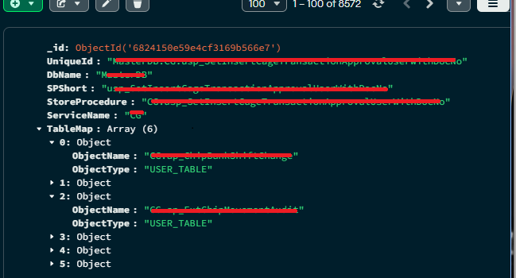
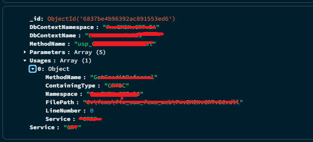
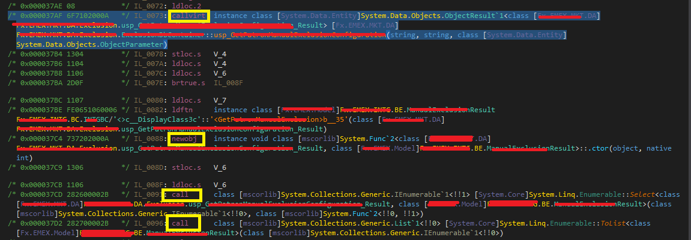

:::Caution
Disclaimer: This blog series is intended solely for educational purposes to share ideas and concepts related to my company system. The content provided, including any proof-of-concept (POC) code, is meant to illustrate ideas and foster learning. No full solutions or sensitive company details are included due to **privacy** and **security** considerations. The POC code shared is not intended for production use and should be treated as illustrative examples only. Readers are encouraged to adapt and expand upon these ideas responsibly, respecting all applicable privacy and security guidelines.
:::

:::Tip
In [Part 1](./part1.md), we dipped our toes into the shallow end of this series to keep things engaging and avoid overwhelming you with too much detail at once.
:::

# Series Overview

- [Part 1](./part1.md): Lay the foundation with essential knowledge for the journey ahead.
- [Part 2](./part2.md): Aggerating AF and BC Relationships, Dive into building our IL Parser for deeper system insights.
- [Part 3](./part3.md): Aggerating BC And Store Procedures Relations
- [Part 4](./part4.md): Dumping soap endpoints and domain models
- [Part 5](./part5.md): Generating C# code for RestFul Api.

# Before We Start

Welcome back to our series on reverse engineering a large, legacy C# system! In this third installment, we dive deeper into the critical task of extracting DbContext classes and stored procedure calls to modernize a complex codebase. Building on our previous discussions, we’ll explore how to systematically analyze DbContext usage and map stored procedure dependencies, paving the way for a smoother migration from SOAP to RESTful APIs. Let’s embark on this technical journey to untangle the intricacies of the system!

# Cross Check : Mapping the data flow

To effectively extract DbContext and stored procedure information, we employ two synchronized workflows: one to analyze DbContext classes and their method usage, and another to extract stored procedure calls from Business Component (BC) methods. These workflows are visualized in the following Mermaid diagram, which illustrates the interconnected processes of scanning DbContext classes and mapping stored procedure dependencies.

The process begins by loading the system’s DLLs using dnlib to access the codebase’s structure. The first workflow scans all DbContext classes, identifies their methods, and determines which methods are invoked by other parts of the system, creating a usage map. Simultaneously, the second workflow examines BC classes, extracts their methods, and identifies stored procedure (USP) calls, mapping their dependencies. These two streams converge to produce a comprehensive usage map, linking DbContext interactions with stored procedure calls, which is critical for understanding the system’s data access patterns.

## Mongo Schema Design

schema for BC extraction

schema for dbcontext sp extraction


## Preparion

Using dnlib, we load the system’s DLLs to access the metadata of classes, methods, and their relationships. This step sets the foundation for analyzing the codebase programmatically, enabling us to extract DbContext and stored procedure information efficiently.

```cs

        var resolver = new AssemblyResolver();
        resolver.EnableTypeDefCache = true;
        var moduleContext = new ModuleContext(resolver);
        foreach (var path in dllPaths.Select(Path.GetDirectoryName).
                                      AsValueEnumerable().
                                      Distinct().
                                      Where(c => !string.IsNullOrEmpty(c)))
        {
            resolver.PreSearchPaths.Add(path);
        }

        // Initialize module cache
        _moduleCache = new Dictionary<string , ModuleDefMD>();
```

# BC Extract DbContext Function

To understand how DbContext is utilized within Business Component (BC) classes, we scan all functions within these classes. This involves iterating through each BC class, identifying methods that interact with DbContext instances, and cataloging their dependencies. This process is essential for mapping data access logic embedded in the business layer.
Lets illustrates a simple BC classes:

```cs
class SomeBC : SomeBCBase
{
    void DoCheckingAndUpdateTransaction(some params)
    {

        // do some business checking
        // do some business logic
        using var context = new SomeDbContext();
        context.usp_UpdateTransaction(some params);
    }
}
```

## Extract Calls And CallVirt from BC Methods


In this step, we focus on extracting Calls and CallVirt instructions from BC methods to identify interactions with DbContext and stored procedures. By analyzing the Intermediate Language (IL) code, we pinpoint method calls that invoke DbContext operations or stored procedure executions. This granular analysis helps us understand the system’s data flow and dependencies, enabling precise extraction of critical components.

```cs

    static async Task<List<IMethodDefOrRef>> AnalyzeMethodCalls(MethodDef method , HashSet<MethodDef> visited)
    {
        var calledMethods = new List<IMethodDefOrRef>();

        if ( !method.HasBody || !visited.Add(method) )
        {
            return calledMethods;
        }

        foreach (var instr in method.Body.Instructions.AsValueEnumerable().
                                     Where(c => ( c.OpCode == OpCodes.Call || c.OpCode == OpCodes.Callvirt ||
                                                  c.OpCode == OpCodes.Ldftn ) && c.Operand != null))
        {
            switch ( instr.Operand )
            {
                case IMethodDefOrRef { DeclaringType: not null } methodRef:
                {
                    // Add the called method
                    if ( methodRef.Name.StartsWith("usp") || !methodRef.DeclaringType.Name.Contains("DisplayClass") )
                    {
                        calledMethods.Add(methodRef);
                    }

                    // If the method is in a DisplayClass, recursively analyze its calls
                    if ( methodRef.DeclaringType.Name.Contains("DisplayClass") ||
                         methodRef.DeclaringType.Name.StartsWith("<") )
                    {
                        MethodDef resolvedMethod = null;
                        try
                        {
                            if ( methodRef is MemberRef memberRef )
                            {
                                resolvedMethod = memberRef.ResolveMethod();
                            }
                            else if ( methodRef is MethodDef methodDef )
                            {
                                resolvedMethod = methodDef;
                            }

                            if ( resolvedMethod != null && resolvedMethod.HasBody )
                            {
                                // Recursively analyze the DisplayClass method
                                var nestedCalls = await AnalyzeMethodCalls(resolvedMethod , visited);
                                calledMethods.AddRange(nestedCalls);
                            }
                        }
                        catch (Exception ex)
                        {
                            Console.
                                    WriteLine($"Failed to resolve or analyze DisplayClass method {_methodFullNameCache.GetOrAdd(methodRef , mr => mr.FullName)}: {ex.Message}");
                        }
                    }

                    break;
                }
            }
        }

        return calledMethods;
    }
```

# Extract DbContext Classes

Lets illustrate sample code using that using **Ado.net**
Extracting DbContext classes involves identifying all classes that inherit from DbContext within the codebase. We use dnlib to scan the DLLs, detect these classes, and catalog their properties and methods. This step is crucial for understanding the data access layer and preparing for migration to a modern architecture.

```cs
class SomeTransactionsContext : DbContext
{
//skip .ctor , get set
ObjectResult  usp_UpdateSomeData(Some params){
      //foo bar
   }
}
```

## Identity Dbcontext classes

To accurately identify DbContext classes, we analyze class inheritance and structure. We look for classes that extend DbContext, verify their properties (such as DbSet definitions), and confirm their role in the data access layer. This process ensures we capture all relevant DbContext classes without missing critical components.

```cs

    static List<TypeDef> FindDbContextClasses(ModuleDefMD module)
    {
        string[] dbContextTypes =
        [
                "System.Data.Entity.DbContext" ,
                "Microsoft.EntityFrameworkCore.DbContext"
        ];

        return module.GetTypes().
                      AsValueEnumerable().
                      Where(t => t.IsClass && !t.IsAbstract).
                      Where(type => InheritsFromDbContext(type , dbContextTypes)).
                      ToList();
    }
```

```cs

    static bool InheritsFromDbContext(TypeDef type , string[] dbContextTypeNames)
    {
        var currentType = type;
        while ( currentType is { BaseType: not null } )
        {
            var baseType = currentType.BaseType;
            if ( baseType is TypeRef typeRef )
            {
                if ( dbContextTypeNames.Contains(_typeRefFullNameCache.GetOrAdd(typeRef , tr => tr.FullName)) )
                {
                    return true;
                }
            }
            else if ( baseType is TypeDef typeDef )
            {
                if ( dbContextTypeNames.Contains(_typeFullNameCache.GetOrAdd(typeDef , td => td.FullName)) )
                {
                    return true;
                }

                currentType = typeDef;
                continue;
            }

            if ( baseType is TypeRef externalRef && externalRef.Resolve() is TypeDef resolvedTypeDef )
            {
                currentType = resolvedTypeDef;
                continue;
            }

            break;
        }

        return false;
    }
```

## Method Analysis

Method analysis involves dissecting the methods within DbContext and BC classes to understand their functionality and interactions. We examine method signatures, parameters, and IL instructions to identify calls to stored procedures and DbContext operations. This detailed analysis helps us build a clear picture of how data access is implemented across the system.

```

                    foreach (var method in dbContextClass.Methods.AsValueEnumerable().
                                                          Where(m => !m.IsConstructor && m is
                                                                     {
                                                                             HasBody  : true , IsPublic: true ,
                                                                             IsVirtual: true
                                                                     }
                                                                  && !m.IsGetter && !m.IsSetter && !m.IsConstructor &&
                                                                     !m.IsCompilerControlled))
{

                        var parsedResult = new ParsedResult
                        {
                                DbContextNamespace = dbContextNamespace ,
                                DbContextName      = dbContextName ,
                                MethodName         = method.Name ,
                                Service            = service ,
                                Parameters = method.Parameters.Select(p => new ParameterInfo(
                                                                           p.Name ?? $"param{p.Index}" ,
                                                                           _typeSigFullNameCache.GetOrAdd(p.Type ,
                                                                            ts => ts.FullName)
                                                                          )).
                                                    ToList() ,
                                Usages = await FindMethodReferences(relevantModules , method , dllPath)
                        };
}
```

## Generate Usages Map

Using the data collected from DbContext and BC method analyses, we generate a comprehensive usage map. This map links DbContext methods to their callers and stored procedure calls to their originating methods, providing a holistic view of the system’s data access patterns. The usage map is instrumental in planning the migration, as it highlights dependencies and potential refactoring points.

```cs

    static async Task<List<MethodUsage>> FindMethodReferences(List<ModuleDefMD> modules , MethodDef targetMethod ,
                                                              string            targetDllPath)
    {
        var usages      = new ConcurrentBag<MethodUsage>();
        var searchTypes = GetSearchTypes(targetMethod.DeclaringType);

        foreach (var module in modules.AsValueEnumerable())
        {
            string filePath = _moduleCache.AsValueEnumerable().FirstOrDefault(kvp => kvp.Value == module).Key ??
                              module.Name;
            var types = module.GetTypes().
                               AsValueEnumerable().
                               Where(t => t.IsClass && !t.Name.StartsWith("<") && !t.Name.Contains("DisplayClass")).
                               ToList();

            await Parallel.ForEachAsync(types , new ParallelOptions { MaxDegreeOfParallelism = 12 } ,
                                        async (type , ctx) =>
                                        {
                                            foreach (var method in type.Methods.AsValueEnumerable().
                                                                        Where(m => m.HasBody && !m.IsConstructor &&
                                                                                  !m.IsGetter &&
                                                                                  !m.IsSetter &&
                                                                                  !m.IsCompilerControlled &&
                                                                                  !m.Name.StartsWith("<") &&
                                                                                  !m.Name.Contains("DisplayClass")))
                                            {
                                                // Check if method's calls are cached
                                                if ( !_methodCallCache.TryGetValue(method , out var calledMethods) )
                                                {
                                                    calledMethods
                                                            = await AnalyzeMethodCalls(method ,
                                                               new HashSet<MethodDef>(new MethodComparer()));
                                                    _methodCallCache.TryAdd(method , calledMethods);
                                                }

                                                if ( calledMethods.Count == 0 ) continue;

                                                // Check cached calls for target method
                                                foreach (var methodRef in calledMethods)
                                                {
                                                    // Resolve methodRef using cache
                                                    if ( !_methodRefCache.TryGetValue(methodRef ,
                                                          out var resolvedMethod) )
                                                    {
                                                        try
                                                        {
                                                            if ( methodRef is MemberRef memberRef )
                                                            {
                                                                resolvedMethod = memberRef.ResolveMethod();
                                                            }
                                                            else if ( methodRef is MethodDef methodDef )
                                                            {
                                                                resolvedMethod = methodDef;
                                                            }

                                                            _methodRefCache.TryAdd(methodRef , resolvedMethod);
                                                        }
                                                        catch (Exception ex)
                                                        {
                                                            Console.
                                                                    WriteLine($"Failed to resolve method reference {_methodFullNameCache.GetOrAdd(methodRef , mr => mr.FullName)}: {ex.Message}");
                                                            _methodRefCache.TryAdd(methodRef , null);
                                                        }
                                                    }

                                                    if ( CanBeReferenceTo(methodRef , targetMethod , searchTypes ,
                                                                          resolvedMethod) )
                                                    {
                                                        usages.Add(new MethodUsage
                                                        {
                                                                MethodName     = method.Name ,
                                                                Namespace      = type.Namespace ,
                                                                ContainingType = type.Name ,
                                                                FilePath       = filePath ,
                                                                LineNumber     = 0 ,
                                                                Service = type.Namespace.ToString().
                                                                               ExtractServiceNameFromNamespace()
                                                        });
                                                        break;
                                                    }
                                                }
                                            }
                                            //return ValueTask.CompletedTask;
                                        });
        }

        return usages.ToList();
    }

```

# Summary

In this installment, we’ve explored the intricate process of extracting DbContext classes and stored procedure calls from a legacy C# system using reverse engineering techniques. By leveraging dnlib to load DLLs, scanning DbContext and BC classes, and mapping their dependencies, we’ve laid the groundwork for a successful migration to a RESTful API architecture. The combined workflow of analyzing DbContext usage and stored procedure calls provides a clear roadmap for modernizing the system, addressing the challenges of over 3,000 domain models and 1,000+ stored procedures. Stay tuned for the next part, where we’ll dive into transforming this data into a MongoDB pipeline and integrating it with a vector database like Neo4j!

# Whats Next

We are going to extract the SOAP Layers.
