:::Caution
Disclaimer: This blog series is intended solely for educational purposes to share ideas and concepts related to my company system. The content provided, including any proof-of-concept (POC) code, is meant to illustrate ideas and foster learning. No full solutions or sensitive company details are included due to **privacy** and **security** considerations. The POC code shared is not intended for production use and should be treated as illustrative examples only. Readers are encouraged to adapt and expand upon these ideas responsibly, respecting all applicable privacy and security guidelines.
:::

:::Tip
In [Part 1](./part1.md), we dipped our toes into the shallow end of this series to keep things engaging and avoid overwhelming you with too much detail at once.
:::

# Series Overview

- [Part 1](./part1.md): Lay the foundation with essential knowledge for the journey ahead.
- [Part 2](./part2.md): Aggerating AF and BC Relationships, Dive into building our IL Parser for deeper system insights.
- [Part 3](./part3.md): Aggerating BC And Store Procedures Relations
- [Part 4](./part4.md): Dumping soap endpoints and domain models
- [Part 5](./part5.md): Generating C# code for RestFul Api.
  Welcome back to our technical blog series on migrating a large, legacy C# system using reverse engineering techniques! In this fourth installment, we dive into the intricacies of handling SOAP services and extracting domain models, a critical step in understanding and modernizing our system. Our focus today is on navigating the complexities of SOAP-based interfaces and extracting the domain models embedded within them using **dnlib**.

## Introduction to SOAP and WSDL Challenges


SOAP (Simple Object Access Protocol) is a protocol for exchanging structured information in web services, typically defined by a WSDL (Web Services Description Language) file. In an ideal world, the WSDL provides a clear contract for service operations, data types, and endpoints. However, in our legacy project, the WSDL is **broken—plagued** by **duplicate namespaces**, conflicting classes, and dependency hell. Fixing the WSDL would be a Herculean task, so we opt for reverse engineering the domain models directly from the codebase using **dnlib**, bypassing the WSDL entirely.

## SOAP Interface Extraction

As discussed in Part 1, each Application Facade (AF) in our system implements interfaces that define service operations. For example, the `PromotionAF` class implements `IPromotionAF`:

```cs
class PromotionAF : IPromotionAF
```

Extracting method signatures from these interfaces is straightforward with **dnlib**. Below is a sample code snippet to iterate through interface methods:

```cs
using dnlib.DotNet;
using System.Linq;

public void ExtractMethods(ModuleDefMD module, TypeDef type)
{
    if (type.IsInterface)
    {
        foreach (var method in type.Methods.Where(m => !m.IsStatic))
        {
            Console.WriteLine($"Method: {method.Name}, Return: {method.ReturnType}");
            foreach (var param in method.Parameters)
            {
                Console.WriteLine($"  Param: {param.Name}, Type: {param.Type}");
            }
        }
    }
}
```

This code scans a given interface (e.g., `IPromotionAF`) and outputs method names, return types, and parameter types, laying the groundwork for domain model extraction.

## Loop Through Parameters and Extract Domain Models

To fully understand the domain, we need to extract the models referenced in method parameters and return types. These models often form complex inheritance hierarchies and may include generic types, as seen in classes like `CreatePromotionRequest`.

### Model Layers

Consider the following example class:

```cs
[DataContract(Namespace = "OurSystemServices")]
public class CreatePromotionRequest : GetPaginationRequestBase<List<PromotionInput>>
{
    [DataMember]
    public bool IsEnrolling;

    [DataMember]
    public long PromotionId;
}
```

In IL (Intermediate Language), this class appears as:

```cs
.class public auto ansi beforefieldinit CreatePromotionRequest
    extends class [HelloWorld.Core]HelloWorld.Core.Entity.Messaging.GetPaginationRequestBase`1<class [mscorlib]System.Collections.Generic.List`1<class [HelloWorld.Core]Hello.World.Model.PromotionInput>>
```

Our goal is to extract the inheritance chain and properties. For `CreatePromotionRequest`, we need to traverse its base class `GetPaginationRequestBase<List<PromotionInput>>`, which itself is generic, and continue until we reach the root, such as `RequestBase`. The full hierarchy might look like:

```cs
public class GetPaginationRequestBase<T> : GetPaginationRequestBase
public class GetPaginationRequestBase : GetRequestBase
public class GetRequestBase : RequestBase
public abstract class RequestBase
```

Additionally, we must scan properties within each class (e.g., `IsEnrolling` and `PromotionId`) and recursively process their types if they are custom classes.

## Collect Usings

```cs

static void CollectUsingsFromGeneric(TypeReference type , HashSet<string> usings)
{
    if ( string.IsNullOrEmpty(type.Namespace) ) return;

    usings.Add(type.Namespace);
    if ( type.IsGenericInstance )
    {
        var gt = type as GenericInstanceType;
        foreach (var param in gt.GenericArguments)
        {
            if ( string.IsNullOrEmpty(param.Namespace) ) continue;

            usings.Add(param.Namespace);
            CollectUsingsFromGeneric(param , usings);
        }
    }
}

static void CollectUsings(TypeDefinition type , HashSet<string> usings)
{
    // Attributes
    if ( type.HasCustomAttributes )
    {
        foreach (var attr in type.CustomAttributes)
        {
            if ( !string.IsNullOrEmpty(attr.AttributeType.Namespace) )
            {
                usings.Add(attr.AttributeType.Namespace);
            }
        }
    }

    // Base class
    if ( type.BaseType          != null && !string.IsNullOrEmpty(type.BaseType.Namespace) &&
         type.BaseType.FullName != "System.Object" )
    {
        //     usings.Add(type.BaseType.Namespace);
        CollectUsingsFromGeneric(type.BaseType , usings);
        //usings.Add(type.BaseType.Namespace);
        //if (type.BaseType.HasGenericParameters)
        //{
        //    foreach (var param in type.BaseType.GenericParameters)
        //    {
        //        usings.Add(param.Namespace);
        //    }
        //}
    }

    // Fields
    foreach (var field in type.Fields.Where(f => !f.IsSpecialName && !f.IsRuntimeSpecialName))
    {
        if ( !field.IsPublic ) continue;

        if ( !string.IsNullOrEmpty(field.FieldType.Namespace) )
        {
            usings.Add(field.FieldType.Namespace);
        }

        foreach (var attr in field.CustomAttributes)
        {
            if ( !string.IsNullOrEmpty(attr.AttributeType.Namespace) )
            {
                usings.Add(attr.AttributeType.Namespace);
            }
        }
    }

    // Properties
    foreach (var property in type.Properties)
    {
        if ( !string.IsNullOrEmpty(property.PropertyType.Namespace) )
        {
            usings.Add(property.PropertyType.Namespace);
        }

        foreach (var attr in property.CustomAttributes)
        {
            if ( !string.IsNullOrEmpty(attr.AttributeType.Namespace) )
            {
                usings.Add(attr.AttributeType.Namespace);
            }
        }
    }

    usings.Add("");
    usings = usings.Where(x => !string.IsNullOrEmpty(x) && !x.Contains("System.Windows")).ToHashSet();
}

```

## Handle Generic Properties and Classes

To handle generics and nested types, we define a recursive scanning algorithm. The process can be visualized with the following Mermaid diagram:

Here’s the corresponding **dnlib** code to implement this logic:

```cs
using dnlib.DotNet;
using System.Collections.Generic;

public class DomainModelExtractor
{
    private readonly HashSet<string> scannedTypes = new HashSet<string>();

    public void ScanType(ModuleDefMD module, TypeDef type)
    {
        if (type == null || type.IsSystemType() || scannedTypes.Contains(type.FullName))
            return;

        scannedTypes.Add(type.FullName);
        Console.WriteLine($"Scanning class: {type.FullName}");

        // Handle base class
        if (type.BaseType != null)
        {
            var baseType = type.BaseType.ResolveTypeDef();
            ScanType(module, baseType);
        }

        // Handle generic parameters
        if (type.HasGenericParameters)
        {
            foreach (var genericParam in type.GenericParameters)
            {
                var genericType = genericParam.GetGenericType(module);
                if (genericType != null)
                    ScanType(module, genericType);
            }
        }

        // Scan properties
        foreach (var property in type.Properties)
        {
            var propertyType = property.PropertySig.RetType.GetTypeDef(module);
            if (propertyType != null && !propertyType.IsSystemType())
            {
                Console.WriteLine($"  Property: {property.Name}, Type: {propertyType.FullName}");
                ScanType(module, propertyType);
            }
        }

            foreach (var t in type.NestedTypes)
            {
                if ( t == null ) continue;
                //scan
            }

            foreach (var f in type.Fields)
            {
                if ( f == null ) continue;
                if ( !f.IsPublic ) continue;
                //scan
            }
    }
}

public static class TypeDefExtensions
{
    public static bool IsSystemType(this TypeDef type)
    {
        return type?.Namespace.StartsWith("System") ?? true;
    }

    public static TypeDef GetTypeDef(this TypeSig typeSig, ModuleDefMD module)
    {
        return typeSig?.TryGetTypeDef()?.ResolveTypeDef();
    }

    public static TypeDef GetGenericType(this GenericParam genericParam, ModuleDefMD module)
    {
        return genericParam.Type?.GetTypeDef(module);
    }
}
```

## Summary

In this part, we tackled the extraction of domain models from SOAP-based interfaces in a legacy C# system. By leveraging **dnlib**, we bypassed a broken WSDL and systematically extracted method signatures and their associated domain models. We addressed the challenges of generic types and inheritance hierarchies, ensuring a comprehensive scan of all relevant classes and properties. This approach provides a clear picture of the system’s domain, a crucial step for migration.

### What’s Next?

In Part 5, we’ll shift gears to **code generation**. Using the extracted domain models, we’ll explore how to generate modernized service contracts and data models, paving the way for a cleaner, more maintainable system.
