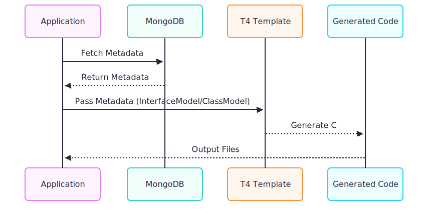
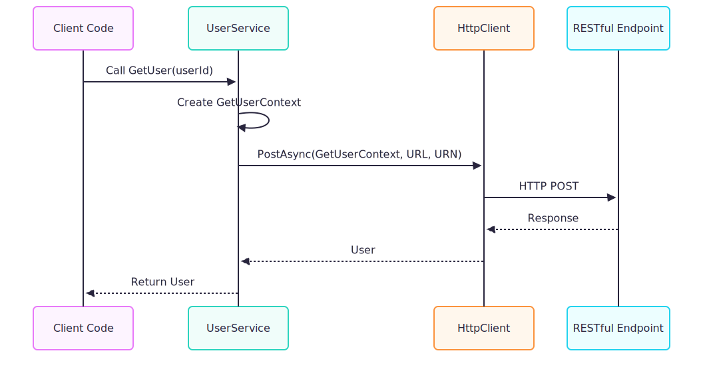

:::Caution
Disclaimer: This blog series is intended solely for educational purposes to share ideas and concepts related to my company system. The content provided, including any proof-of-concept (POC) code, is meant to illustrate ideas and foster learning. No full solutions or sensitive company details are included due to **privacy** and **security** considerations. The POC code shared is not intended for production use and should be treated as illustrative examples only. Readers are encouraged to adapt and expand upon these ideas responsibly, respecting all applicable privacy and security guidelines.
:::

:::Tip
In [Part 1](./part1.md), we dipped our toes into the shallow end of this series to keep things engaging and avoid overwhelming you with too much detail at once.
:::

# Series Overview

- [Part 1](./part1.md): Lay the foundation with essential knowledge for the journey ahead.
- [Part 2](./part2.md): Aggerating AF and BC Relationships, Dive into building our IL Parser for deeper system insights.
- [Part 3](./part3.md): Aggerating BC And Store Procedures Relations
- [Part 4](./part4.md): Dumping soap endpoints and domain models
- [Part 5](./part5.md): Generating C# code for RestFul Api.

# Introduction to T4 Templates for Code Generation

In the world of legacy system migration, automating code generation is a game-changer. When modernizing large C# systems, especially those relying on SOAP services, manual refactoring can be a daunting task. This is where **T4 (Text Template Transformation Toolkit)** templates shine, offering a powerful way to generate consistent, maintainable code. In Part 5 of our series, we dive into using T4 templates in combination with reverse engineering techniques (powered by tools like **dnlib**) to generate RESTful API interfaces, implementations, and domain models from a legacy SOAP-based system.

In previous parts, we explored how to parse a legacy C# system's DLLs using **dnlib**, store metadata in **MongoDB**, and prepare the groundwork for automation. Now, we'll leverage this metadata to generate RESTful API code and domain models, reducing manual effort and ensuring consistency. Along the way, we'll highlight opportunities for visualizing the process with diagrams to make the concepts clearer.
:::Tip
**Why T4?** T4 templates allow developers to write code that generates code, enabling dynamic creation of classes, interfaces, and more based on metadata. Combined with reverse engineering, T4 becomes a powerful tool for modernizing legacy systems.

:::


---

## Understanding T4 Magic and Partial Classes

T4 templates are a blend of static text and C# code, executed at design time or runtime to produce output files (e.g., C# classes, interfaces, or even JSON). The magic lies in their ability to combine logic with text output, making them ideal for generating repetitive code patterns.

Let’s start with a simple example to illustrate how T4 works with **partial classes**, a key feature for extending generated code.

### Example: Generating Greetings with T4

Consider a T4 template, `example.tt`, designed to output a list of greeting strings:

```cs
<#@ template language="C#" #>
<#@ assembly name="System.Core" #>
<#@ import namespace="System.Linq" #>
<#@ import namespace="System.Text" #>
<#@ import namespace="System.Collections.Generic" #>
```

The generated code for this template resides in a **partial class**, `ExampleTemplate`, which inherits from `ExampleTemplateBase`:

```cs
// ------------------------------------------------------------------------------
// <auto-generated>
//     This code was generated by a tool.
//     Runtime Version: 17.0.0.0
//
//     Changes to this file may cause incorrect behavior and will be lost if
//     the code is regenerated.
// </auto-generated>
// ------------------------------------------------------------------------------
public partial class ExampleTemplate : ExampleTemplateBase
```

Because the generated class is **partial**, we can extend it in a separate file to add custom logic or data:

```cs
public partial class ExampleTemplate
{
    public List<string> Greetings { get; set; } = new()
    {
        "I'm the magic",
        "Hello readers"
    };
}
```

Now, in the T4 template, we can iterate over the `Greetings` list to generate output:

```cs
<#@ template language="C#" #>
<#@ assembly name="System.Core" #>
<#@ import namespace="System.Linq" #>
<#@ import namespace="System.Text" #>
<#@ import namespace="System.Collections.Generic" #>
<# foreach (var magicStr in Greetings) { #>
    <#= magicStr #>
<# } #>
```

When executed, this template generates the following output:

```
I'm the magic
Hello readers
```

To trigger the transformation, you instantiate the template and call `TransformText()`:

```cs
ExampleTemplate exampleTemplate = new();
string result = exampleTemplate.TransformText();
```

This simple example demonstrates the power of T4: combining static text, dynamic logic, and partial classes to generate customized output. Now, let’s apply this to a real-world scenario—generating RESTful APIs from a legacy SOAP system.

## 

# Preparation for RESTful API Generation

In Parts 2–4, we used **dnlib** to parse a legacy C# system’s DLLs, extracting metadata about classes, methods, and properties, and stored this metadata in **MongoDB**. This metadata now serves as the input for our T4 templates, enabling us to generate RESTful API interfaces, implementations, request/response models, and domain models.


The process involves:

1. Fetching metadata from MongoDB (e.g., namespace, method names, parameter types).
2. Feeding this metadata into T4 templates.
3. Generating C# code for RESTful APIs and domain models.

---

## Service Interface Template


The service interface template generates an interface for a RESTful API based on the parsed SOAP service metadata. This interface defines the contract for the service, including method signatures and return types.

Here’s an example T4 template for generating a service interface:

```cs
<#@ template language="C#" #>
<#@ assembly name="System.Core" #>
<#@ import namespace="System.Linq" #>
<#@ import namespace="System.Text" #>
<#@ import namespace="System.Collections.Generic" #>

//DLL Name : <#= Model.DllName #>
//WARNING:DO NOT MOTIFIED IT ,it will cuz unexpected error
// Methods Count : <#= Model.MethodCount #>
//<#= Model.Time #>
<# foreach (var u in Model.Usings) { #>
using <#= u #>;
<# } #>
using System.Threading.Tasks;
namespace <#= Model.Namespaces #>
{
    public interface I<#= Model.ServiceName #> : ProveOfConceptForNotes.HttpClient.Interfaces.IOurTargetSystemNamespacesService
    {
        <# foreach (var method in Model.Methods) { #>
        Task<<#= method.ReturnType #>> <#= method.Name #>(<#= string.Join(", ", method.Parameters.Select(p => $"{p.Type} {p.Name}")) #>);
        <# } #>
    }
}
```

### Explanation

- **Metadata Input**: The `Model` object (of type `InterfaceModel`) contains metadata like `DllName`, `Namespaces`, `ServiceName`, `Usings`, and a list of `Methods` (each with a `Name`, `ReturnType`, and `Parameters`).
- **Output**: The template generates a C# interface that inherits from a base interface (`IOurTargetSystemNamespacesService`) and includes async methods based on the metadata. For example, if the metadata includes a method `GetUser` with a return type of `User` and a parameter `int userId`, the output might look like:
  ```cs
  //DLL Name: LegacySystem.dll
  //WARNING:DO NOT MOTIFIED IT ,it will cuz unexpected error
  //Methods Count: 1
  //7/26/2025 12:00:00 AM
  using System;
  using System.Threading.Tasks;
  namespace LegacySystem.Services
  {
      public interface IUserService : ProveOfConceptForNotes.HttpClient.Interfaces.IOurTargetSystemNamespacesService
      {
          Task<User> GetUser(int userId);
      }
  }
  ```

---

## Service Implementation Template


Next, we generate the implementation of the service interface, which handles HTTP requests to the RESTful API. This template builds on the same metadata to create a class that implements the interface and integrates with a base service class for HTTP communication.

```cs
<#@ template language="C#" #>
<#@ assembly name="System.Core" #>
<#@ import namespace="System.Linq" #>
<#@ import namespace="System.Text" #>
<#@ import namespace="System.Collections.Generic" #>

//DLL Name : <#= Model.DllName #>
//WARNING:DO NOT MOTIFIED IT ,it will cuz unexpected error
// Methods Count : <#= Model.MethodCount #>
//<#= Model.Time #>
<# foreach (var u in Model.Usings) { #>
using <#= u #>;
<# } #>
using System.Threading.Tasks;
using ProveOfConceptForNotes.HttpClient.Interfaces;
namespace <#= Model.Namespaces #>
{
    public class <#= Model.ServiceName #> : ProveOfConceptForNotes.HttpClient.Services.ServiceBase, I<#= Model.ServiceName #>
    {
        /// <inheritdoc />
        public <#= Model.ServiceName #>(string serviceUrl, ICompressionService compressionService, IWcfBinarySerializer wcfBinarySerializer, System.Net.Http.HttpClient httpClient, ISoapMessageSerializer soapMessageSerializer) : base(serviceUrl, compressionService, wcfBinarySerializer, httpClient, soapMessageSerializer)
        {
        }
        <# foreach (var method in Model.Methods) { #>
        public async Task<<#= method.ReturnType #>> <#= method.Name #>(<#= string.Join(", ", method.Parameters.Select(p => $"{p.Type} {p.Name}")) #>)
        {
            var requestContext = new <#= method.Name #>Context();
            requestContext.Request = <#= method.Parameters[0].Name #>;
            return await this.PostAsync<<#= method.Name #>Context, <#= method.ReturnType #>>(requestContext, ServiceUrl, "urn:<#= Model.ServiceName #>/<#= method.Name #>", cancellationToken);
        }
        <# } #>
    }
}
```

### Implementation Details

- **Constructor**: The generated class inherits from `ServiceBase` and accepts dependencies like `HttpClient`, `ICompressionService`, and serializers, which handle HTTP communication and SOAP message processing.
- **Methods**: Each method creates a request context (e.g., `GetUserContext`), sets the request payload, and calls `PostAsync` to send the request to the RESTful endpoint.
- **Output Example**: For a `UserService` with a `GetUser` method, the output might be:
  ```cs
  //DLL Name: LegacySystem.dll
  //WARNING:DO NOT MOTIFIED IT ,it will cuz unexpected error
  //Methods Count: 1
  //7/26/2025 12:00:00 AM
  using System;
  using System.Threading.Tasks;
  using ProveOfConceptForNotes.HttpClient.Interfaces;
  namespace LegacySystem.Services
  {
      public class UserService : ProveOfConceptForNotes.HttpClient.Services.ServiceBase, IUserService
      {
          /// <inheritdoc />
          public UserService(string serviceUrl, ICompressionService compressionService, IWcfBinarySerializer wcfBinarySerializer, System.Net.Http.HttpClient httpClient, ISoapMessageSerializer soapMessageSerializer) : base(serviceUrl, compressionService, wcfBinarySerializer, httpClient, soapMessageSerializer)
          {
          }
          public async Task<User> GetUser(int userId)
          {
              var requestContext = new GetUserContext();
              requestContext.Request = userId;
              return await this.PostAsync<GetUserContext, User>(requestContext, ServiceUrl, "urn:UserService/GetUser", cancellationToken);
          }
      }
  }
  ```

---

## Request/Response Model


To support the RESTful API, we need request and response models. These are typically simple data contracts that wrap the input and output data for each method.

```cs
<#@ template language="C#" #>
<#@ assembly name="System.Core" #>
<#@ import namespace="System.Linq" #>
<#@ import namespace="System.Text" #>
<#@ import namespace="System.Collections.Generic" #>
//Generated From OurTargetSystemNamespaces DLL
//This DLL is auto Emit from Services Contract for werid cms soap
/The generated class inherits from ServiceBase and implements the corresponding service interface, ensuring consistency with the defined contract. The constructor injects dependencies such as HttpClient, ICompressionService, and serializers, which facilitate HTTP communication and SOAP message processing. Each method creates a request context specific to the operation (e.g., GetUserContext for GetUser), populates it with input parameters, and invokes PostAsync to send the request to the RESTful endpoint. This design encapsulates the complexity of HTTP communication, providing a robust and reusable implementation for each service method.The generated class inherits from ServiceBase and implements the corresponding service interface, ensuring consistency with the defined contract. The constructor injects dependencies such as HttpClient, ICompressionService, and serializers, which facilitate HTTP communication and SOAP message processing. Each method creates a request context specific to the operation (e.g., GetUserContext for GetUser), populates it with input parameters, and invokes PostAsync to send the request to the RESTful endpoint. This design encapsulates the complexity of HTTP communication, providing a robust and reusable implementation for each service method./DO NOT MOTIFIED IT ,it will cuz unexpected error
//<#= Time #>
using System;
using System.Runtime.Serialization;
namespace <#= Namespaces #>
{
	[DataContract(Name="<#= DataName #>", Namespace="")]
	public class <#= DataName #>Context
	{
		[DataMember(Name="request")] public <#= ReturnType #> Request { get; set; }
	}
}
```

### Explanation

- **Purpose**: This template generates a data contract class (e.g., `GetUserContext`) that wraps the request data for a specific method. The `DataContract` and `DataMember` attributes ensure compatibility with serialization (e.g., for JSON or XML).
- **Output Example**:
  ```cs
  //Generated From OurTargetSystemNamespaces DLL
  //This DLL is auto Emit from Services Contract for werid cms soap
  //DO NOT MOTIFIED IT ,it will cuz unexpected error
  //7/26/2025 12:00:00 AM
  using System;
  using System.Runtime.Serialization;
  namespace LegacySystem.Services
  {
      [DataContract(Name="GetUser", Namespace="")]
      public class GetUserContext
      {
          [DataMember(Name="request")] public int Request { get; set; }
      }
  }
  ```

---

## Domain Model


The domain model template generates C# classes representing entities in the system, complete with properties and attributes, based on the metadata extracted from the legacy DLL.

```cs
<#@ template language="C#" #>
<#@ assembly name="System.Core" #>
<#@ import namespace="System.Linq" #>
<#@ import namespace="System.Text" #>
<#@ import namespace="System.Collections.Generic" #>
//Generated From OurTargetSystemNamespaces DLL
//DLL Name : <#= Model.DllName #>
//WARNING:DO NOT MOTIFIED IT ,it will cuz unexpected error
//<#= Model.Time #>

<# foreach (var usingDirective in Model.Usings) { #>
using <#= usingDirective #>;
<# } #>

namespace <#= Model.Namespaces #>
{
<# foreach (var attribute in Model.Attributes) { #>
	<#= attribute #>
<# } #>
	public <#= Model.Modifier #> class <#= Model.Name #> <#= Model.BaseClass #>
	{
<# foreach (var property in Model.Properties) { #>
<# if (property.IsCommented) { #>
<# foreach (var attr in property.Attributes) { #>
	// <#= attr #> <# } #> // public <#= property.ReturnType #> <#= property.Name #> { get; set; } <#
	} else {
	#>
	<# foreach (var attr in property.Attributes) { #>
		<#= attr #>
	<# } #>
		public <#= property.ReturnType #> <#= property.Name #> { get; set; }
	<# } #>
	<# } #>
	}
}
```

### Explanation

- **Metadata Input**: The `ClassModel` contains details like `DllName`, `Namespaces`, `Attributes`, `Name`, `Properties`, `Modifier` (e.g., `public`), and `BaseClass`.
- **Conditional Logic**: The template supports commented-out properties (e.g., for deprecated fields) using the `IsCommented` flag.
- **Output Example**:
  ```cs
  //Generated From OurTargetSystemNamespaces DLL
  //DLL Name: LegacySystem.dll
  //WARNING:DO NOT MOTIFIED IT ,it will cuz unexpected error
  //7/26/2025 12:00:00 AM
  using System;
  namespace LegacySystem.Models
  {
      [DataContract]
      public class User
      {
          [DataMember]
          public int Id { get; set; }
          [DataMember]
          public string Name { get; set; }
          // [DataMember] // public string DeprecatedField { get; set; }
      }
  }
  ```

---

## Partial Classes for Template Extensibility


To make T4 templates extensible, we use partial classes to add custom logic or data to the generated code. Here’s how we define partial classes for our templates:

```cs
public partial class ServiceImplTemplate
{
    public InterfaceModel Model { get; set; }
}

public partial class ServicesInterfacesTemplate
{
    public InterfaceModel Model { get; set; }
}

public partial class RequestClassTemplate
{
    public string   DataName   { get; set; }
    public string   Namespaces { get; set; }
    public string   ClassName  { get; set; }
    public DateTime Time       { get; set; } = DateTime.Now;
    public string   ReturnType { get; set; }
}

public partial class ClassTemplate
{
    public ClassModel Model { get; set; }
}
```

### Explanation

- **Purpose**: These partial classes allow you to inject metadata (e.g., `InterfaceModel` or `ClassModel`) into the T4 templates, enabling dynamic code generation.
- **Extensibility**: By keeping the generated code partial, you can add custom methods or properties in separate files without modifying the generated output.

**Diagram Opportunity**: A UML class diagram showing the relationship between the T4 template, its generated partial class, and the custom partial class with the `Model` property.

---

## Template Models


The metadata models drive the T4 templates, providing a structured way to represent the parsed DLL data. Here are the key models:

```cs
public class InterfaceModel
{
    public DateTime          Time        { get; set; } = DateTime.Now;
    public string            Namespaces  { get; set; }
    public string            ServiceName { get; set; }
    public string            DllName     { get; set; }
    public List<string>      Usings      { get; set; }
    public int               MethodCount => Methods.Count;
    public List<MethodModel> Methods     { get; set; }
}

public class MethodModel
{
    public string               Name       { get; set; }
    public string               ReturnType { get; set; }
    public List<ParameterModel> Parameters { get; set; }
}

public class ParameterModel
{
    public string FriendlyName   { get; set; }
    public string TypeNamespaces { get; set; }
    public string TypeShortName  { get; set; }
    public string Type           { get; set; }
    public string Name           { get; set; }
}

public class ClassModel
{
    public string              DllName    { get; set; }
    public List<string>        Usings     { get; set; }
    public string              Namespaces { get; set; }
    public List<string>        Attributes { get; set; }
    public string              Name       { get; set; }
    public List<PropertyModel> Properties { get; set; }
    public string              Modifier   { get; set; }
    public DateTime            Time       { get; set; } = DateTime.Now;
    public string              BaseClass  { get; set; }
}

public class PropertyModel
{
    public List<string> Attributes  { get; set; }
    public string       ReturnType  { get; set; }
    public string       Name        { get; set; }
    public bool         IsCommented { get; set; }
}
```

### Explanation

- **InterfaceModel**: Represents a service interface with its namespace, name, methods, and metadata like DLL name and generation time.
- **MethodModel**: Captures method details, including name, return type, and parameters.
- **ParameterModel**: Stores parameter metadata, including type and name.
- **ClassModel**: Represents a domain model class with properties, attributes, and inheritance details.
- **PropertyModel**: Defines individual properties, including support for commenting out deprecated fields.

---

# Summary

In this post, we explored how to use T4 templates to automate the generation of RESTful API interfaces, implementations, request/response models, and domain models for a legacy C# system. By leveraging metadata extracted via **dnlib** and stored in **MongoDB**, we can create consistent, maintainable code that bridges the gap between SOAP and RESTful architectures. The use of partial classes and structured metadata models ensures extensibility and flexibility, making it easier to adapt the generated code to specific needs.
