:::Tip
this article is written in 2025 before .NET10 release , so hopefully SERVO is coming since it already exist in DOTNET CoreClr Source code
:::

# Introduction

The .NET Core runtime, specifically its CoreCLR implementation, includes a sophisticated garbage collector (GC) that manages memory for applications across cloud, mobile, desktop, and IoT platforms. A key component of this GC is the `generation_to_condemn` function, which determines which generation of the managed heap to collect during a GC cycle. This article explores the role of `generation_to_condemn`, its integration with the experimental SERVO GC tuning feature, and how it enhances memory management in .NET Core applications.

## Source Code generation_to_condemn

In

- .NET CoreCLR Garbage Collector, [runtime/src/coreclr/gc/gc.cpp](https://github.com/dotnet/coreclr/blob/master/src/gc/gc.cpp)

```cs
/*
    This is called by when we are actually doing a GC, or when we are just checking whether
    we would do a full blocking GC, in which case check_only_p is TRUE.

    The difference between calling this with check_only_p TRUE and FALSE is that when it's
    TRUE:
            settings.reason is ignored
            budgets are not checked (since they are checked before this is called)
            it doesn't change anything non local like generation_skip_ratio
*/
int gc_heap::generation_to_condemn (int n_initial,
                                    BOOL* blocking_collection_p,
                                    BOOL* elevation_requested_p,
                                    BOOL check_only_p)
```

## References

- .NET CoreCLR Garbage Collector, [runtime/src/coreclr/gc/gc.cpp](https://github.com/dotnet/coreclr/blob/master/src/gc/gc.cpp)
- GC Configuration,[runtime/src/coreclr/gc/gcconfig.h](https://github.com/dotnet/runtime/blob/main/src/coreclr/gc/gcconfig.h)
- .NET CoreCLR Garbage Collector,[runtime/src/coreclr/gc/gc.cpp](https://github.com/dotnet/coreclr/blob/master/src/gc/gc.cpp)
- GC Configuration,[runtime/src/coreclr/gc/gcconfig.h](https://github.com/dotnet/runtime/blob/main/src/coreclr/gc/gcconfig.h)

## The Role of `generation_to_condemn`

The .NET GC employs a generational approach, dividing objects into three generations:

- **Generation 0**: Short-lived objects, such as temporary variables.
- **Generation 1**: Objects that survive a Gen 0 collection, acting as a buffer between short- and long-lived objects.
- **Generation 2**: Long-lived objects, including static data and large objects in the Large Object Heap (LOH).

The `generation_to_condemn` function, located in the `gc.cpp` file of the `dotnet/runtime` repository, decides which generation to collect based on runtime conditions. It takes inputs like the `gc_mechanisms` structure, which contains GC settings, and evaluates factors such as:

- **Memory Pressure**: The amount of memory allocated since the last collection.
- **Allocation Budgets**: Predefined thresholds for each generation’s memory usage.
- **Induced GC Triggers**: Manual GC requests from the application or runtime.
- **SERVO GC Tuning**: Dynamic adjustments based on performance metrics (if enabled).

The function returns an integer indicating the generation to collect (0, 1, or 2) or a value signaling a full collection, including the LOH. This decision is critical for balancing memory reclamation and application performance, as collecting higher generations (e.g., Gen 2) is more resource-intensive but reclaims more memory.

# How `generation_to_condemn` Works

The logic of `generation_to_condemn` can be broken down into several steps:

1. **Input Evaluation**: The function analyzes the `gc_mechanisms` structure and flags indicating whether the GC is induced or triggered by memory pressure.
2. **Budget Checks**: It compares current memory usage against allocation budgets for each generation. For example, if Gen 0’s budget is exceeded, it selects Gen 0 for collection.
3. **Threshold Analysis**: For higher generations, it evaluates thresholds like memory usage ratios or fragmentation levels.
4. **SERVO GC Integration**: If SERVO GC tuning is enabled, the function adjusts its decision based on dynamic metrics, such as allocation rates or pause time goals.
5. **Generation Selection**: The function returns the selected generation, guiding the GC to collect the appropriate heap segment.

This process ensures that the GC collects only the necessary objects, minimizing pause times while maintaining memory efficiency.

# SERVO GC Tuning

SERVO GC is an experimental feature in the .NET Core GC that introduces dynamic tuning to optimize collection decisions. Unlike the standard GC, which relies on static heuristics, SERVO GC uses feedback loops to monitor runtime metrics, such as:

- **Allocation Rates**: How frequently objects are allocated.
- **Pause Times**: The duration of GC pauses, which impact application responsiveness.
- **Memory Usage**: The current state of the managed heap.

In the context of `generation_to_condemn`, SERVO GC adjusts the generation selection to optimize performance. For example, it may prioritize frequent Gen 0 collections to reduce pause times in high-allocation scenarios or delay Gen 2 collections to avoid costly full GCs. Key configuration parameters, such as `BGCFLTuningEnabled` and `BGCG2RatioStep`, control this behavior, though they remain experimental and are not yet part of standard .NET configurations.

# Overview


The `generation_to_condemn` function is a pivotal decision point in the GC cycle. It evaluates inputs like memory pressure and SERVO metrics, selects the appropriate generation, and updates heap statistics for future cycles. The following diagram illustrates this process:


At a detailed level, the function follows a decision tree, checking budgets and thresholds for each generation and incorporating SERVO adjustments when enabled. The diagram below details this logic:

## Conclusion

The `generation_to_condemn` function is a cornerstone of the .NET Core garbage collector, enabling efficient memory management through generational collection. The introduction of SERVO GC tuning enhances its capabilities by adding dynamic, performance-driven decision-making. While still experimental, SERVO GC promises to improve application performance by adapting to runtime conditions, making it a significant advancement for .NET Core developers. As the feature matures, it may become a standard part of the .NET ecosystem, offering greater control over memory management in diverse application scenarios.
