# Some Resouces

- [.NET CLR GC Implementation](https://raw.githubusercontent.com/dotnet/runtime/main/src/coreclr/gc/gc.cpp)
- [The Garbage Collection Handbook: The Art of Automatic Memory Management](http://www.amazon.com/Garbage-Collection-Handbook-Management-Algorithms/dp/1420082795)
- [Garbage collection (Wikipedia)](<http://en.wikipedia.org/wiki/Garbage_collection_(computer_science)>)
- [Pro .NET Memory Management](https://prodotnetmemory.com/)
- [.NET GC Internals video series](https://www.youtube.com/playlist?list=PLpUkQYy-K8Y-wYcDgDXKhfs6OT8fFQtVm)

# WorkStation GC (WKS GC)


By reading DOTNET source code , in file [runtime/src/coreclr/gc
/gc.cpp](https://github.com/dotnet/runtime/blob/main/src/coreclr/gc/gc.cpp)

````c
Given WKS GC with concurrent GC off, GarbageCollectGeneration is done all
on the user thread that triggered the GC. The code flow is:

     GarbageCollectGeneration()
     {
         SuspendEE();
         garbage_collect();
         RestartEE();
     }

     garbage_collect()
     {
         generation_to_condemn();
         gc1();
     }

     gc1()
     {
         mark_phase();
         plan_phase();
     }

     plan_phase()
     {
         // actual plan phase work to decide to
         // compact or not
         if (compact)
         {
             relocate_phase();
             compact_phase();
         }
         else
             make_free_lists();
     }

# Server GC

```c
GarbageCollectGeneration()
{
	//wake up an event
	ee_suspend_event.set();
	wait_for_gc_done();
}

gc_thread_function()
{
	while (1)
	{
		ee_suspend_event.Wait();
		SuspendEE();
		garbage_collect();
		RestartEE();
	}
}

garbage_collect()
{
	generation_to_condemn();
	gc1();
}

gc1()
{
	mark_phase();
	plan_phase();
}

plan_phase()
{
	// actual plan phase work to decide to
	// compact or not
	if (compact)
	{
		relocate_phase();
		compact_phase();
	}
	else
		make_free_lists();
}

````

# WorkStation Background(Concurrent)[Default Case for WKS GC]



By reading DOTNET source code , in file [runtime/src/coreclr/gc
/gc.cpp](https://github.com/dotnet/runtime/blob/main/src/coreclr/gc/gc.cpp)

```c

Given WKS GC with concurrent GC on (default case), the code flow for a background GC is

     GarbageCollectGeneration()
     {
         SuspendEE();
         garbage_collect();
         RestartEE();
     }

     garbage_collect()
     {
         generation_to_condemn();
         // decide to do a background GC
         // wake up the background GC thread to do the work
         do_background_gc();
     }

     do_background_gc()
     {
         init_background_gc();
         start_c_gc ();

         //wait until restarted by the BGC.
         wait_to_proceed();
     }

     bgc_thread_function()
     {
         while (1)
         {
             // wait on an event
             // wake up
             gc1();
         }
     }

     gc1()
     {
         background_mark_phase();
         background_sweep();
     }
```

# Server Background(Concurrent)



```c

GarbageCollectGeneration()
{
	//wake up an event
	ee_suspend_event.set();
	wait_for_gc_done();
}

gc_thread_function()
{
	while (1)
	{
        ee_suspend_event.Wait();

		SuspendEE();
		garbage_collect();
		RestartEE();
	}
}

garbage_collect()
{
    generation_to_condemn();
    // decide to do a background GC
    // wake up the background GC thread to do the work
    do_background_gc();
}

do_background_gc()
{
    init_background_gc();
    start_c_gc();

    //wait until restarted by the BGC.
    wait_to_proceed();
}

bgc_thread_function()
{
    while (1)
    {
        bgc_start_event.Wait();

        gc1();
    }
}

gc1()
{
    background_mark_phase();
    background_sweep();
}

```
