::github{repo="dotnet/runtime"}

# Background: mark_object_simple in .NET Garbage Collector

The `mark_object_simple` function is a core component of the .NET CoreCLR Garbage Collector (GC), implemented in the `gc.cpp` file of the .NET runtime. It is part of the **mark phase** of the garbage collection process, which identifies live objects in the managed heap to determine which objects can be reclaimed during the sweep phase. The .NET GC is a generational, mark-and-sweep collector that manages memory for .NET applications, ensuring efficient allocation and deallocation of objects.

### Purpose

The primary purpose of `mark_object_simple` is to **mark objects as live** by traversing the object graph starting from a given root object. It ensures that objects still in use (reachable from roots like stack variables, static fields, or handles) are preserved during garbage collection. The function operates by:

- Checking if an object is valid (not null) and not pinned (i.e., not fixed in memory to prevent relocation).
- Marking the object as live, typically by setting a bit in the object header or adding it to a mark stack for further processing.
- Recursively processing the object's fields to mark referenced objects, ensuring the entire reachable object graph is preserved.

### Usage

`mark_object_simple` is used during the **mark phase** of garbage collection, particularly in scenarios involving:

- **Generational GC**: It processes objects in specific generations (e.g., Gen0, Gen1, or Gen2) during minor or full collections, ensuring only reachable objects survive.
- **General-Purpose Marking**: Unlike specialized marking functions (e.g., `mark_object_simple1`, which handles partial objects or collectible classes with a DFS approach), `mark_object_simple` is designed for general-purpose marking of objects in the managed heap, making it suitable for complex object graphs.
- **Parallel/Concurrent GC**: The function leverages a mark stack to support iterative processing, enabling work-stealing or parallel marking in multi-threaded GC scenarios, improving performance on multi-core systems.
- **Stack Overflow Handling**: It includes mechanisms to handle mark stack overflows, ensuring robustness when processing large or deeply nested object graphs.

### Context in .NET GC

In the CoreCLR GC, `mark_object_simple` is part of the server-mode GC (`SERVER_SC_MARK_VOLATILE`) and is invoked during the marking phase to traverse objects from roots. It interacts with the mark stack to manage objects awaiting processing and updates GC boundaries (`m_boundary`) to track promoted objects. The function is optimized for standard object marking, contrasting with `mark_object_simple1`, which includes specialized handling for partial objects, large objects, and collectible classes using a depth-first search (DFS) approach.

### Significance

`mark_object_simple` is critical for maintaining memory safety in .NET applications by ensuring that only unreachable objects are reclaimed, preventing memory leaks while minimizing pauses during garbage collection. Its general-purpose design makes it a foundational component of the GC, used across various collection scenarios to balance performance and reliability.

# High Level Process Of CoreClr

# GC Nodes Workflow

# mark_object_simple [Recursive Scan]

Uses a **mark stack** to manage objects, enabling iterative processing of object fields.
Recursively marks fields if they exist, pushing them onto the stack for further processing.
Handles **stack overflow** explicitly, suggesting it’s designed for complex object graphs where stack limits might be hit.
Likely used in the general marking phase of the garbage collector, where objects are processed iteratively to avoid deep recursion.

Does not explicitly distinguish between object types (e.g., large vs. small objects) in the flowchart, suggesting it handles all objects uniformly using the mark stack.
Explicitly checks for mark stack fullness and handles overflow, indicating it’s designed for scenarios where many objects need to be tracked during marking

# mark_object_simple1 [DFS Scan]

Processes fields directly using **go_through_object_cl** for small objects and go*through_object for partial/large objects.
Handles partial objects by tracking a start pointer and resuming marking from a specific reference (**ref_to_continue**).
Small objects (size < partial_size_th * sizeof(uint8*t*)) Processes fields using **go_through_object_cl**.
Large/partial objects: Uses go_through_object with a start pointer, handling partial references and continuation.
Collectible classes: Pushes class objects onto the mark stack if they exist and are marked.
Includes special logic for stolen objects (**stolen_p**) and partial objects (**partial_p**).
Supports sorting the mark stack (**SORT_MARK_STACK**) to optimize processing order.
Handles overflow by tracking **min_overflow_address** and **max_overflow_address**.

## Simplify flow

## Full flow

# The Diff

## Diff flow

## Summary Table

| Aspect                   | `mark_object_simple`                                      | `mark_object_simple1`                                                                                                |
| ------------------------ | --------------------------------------------------------- | -------------------------------------------------------------------------------------------------------------------- |
| **Marking Approach**     | Iterative, uses mark stack for recursive field processing | DFS-based, uses mark stack with direct field processing in a loop                                                    |
| **Field Processing**     | Recursively marks fields by pushing to mark stack         | Processes fields directly (`go_through_object_cl` or `go_through_object`), non-recursive within loop                 |
| **Object Type Handling** | Uniform handling of objects, no special cases inferred    | Handles small objects (`go_through_object_cl`), partial/large objects (`go_through_object`), and collectible classes |
| **Partial Objects**      | Not explicitly handled (inferred)                         | Tracks `start` pointer and `ref_to_continue` for partial object marking                                              |
| **Collectible Classes**  | Not explicitly handled (inferred)                         | Checks for collectible classes, pushes class objects to mark stack                                                   |
| **Stack Management**     | Uses mark stack with overflow checks                      | Uses mark stack with overflow checks, supports sorting (`SORT_MARK_STACK`)                                           |
| **Special Checks**       | Basic null and pinned checks (inferred)                   | Additional checks for stolen objects (`stolen_p`) and partial objects (`partial_p`)                                  |
| **Boundary Updates**     | Likely uses `m_boundary` or similar (inferred)            | Uses `m_boundary` or `m_boundary_fullgc` based on full GC flag                                                       |
| **Use Case**             | General-purpose marking for complex object graphs         | Specialized DFS marking, optimized for partial objects, large objects, and collectible classes                       |
| **Performance**          | Higher memory use due to recursive stack pushes           | Potentially lower memory overhead for small objects, but complex for partial objects                                 |
