Memory management is a critical aspect of modern operating systems, enabling efficient use of a computer’s resources. This article explores the concepts of physical memory, virtual address spaces, and the process of translating virtual addresses to physical addresses using the Memory Management Unit (MMU), Translation Lookaside Buffer (TLB), Page Table, and handling Page Faults.

# Physical Memory

Physical memory, or RAM, is the actual hardware where data and instructions are stored during a process's execution. However, its size is limited, necessitating sophisticated management techniques to maximize its utilization.

## Virtual Address Spaces

Each process operates within its own virtual address space, an abstraction provided by the operating system. This space allows processes to use memory as if they have exclusive access to the entire address range, isolated from one another for security and stability.

## From Virtual to Physical Address

The translation from virtual to physical addresses is a core function of memory management. This process begins when the CPU generates a virtual address, which the MMU translates into a physical address for accessing RAM.

### MMU

The MMU is a hardware component within the CPU responsible for handling address translation. It works in tandem with the operating system to ensure that virtual addresses are correctly mapped to physical locations.

### TLB

The TLB is a small, fast cache within the MMU that stores recent translations of virtual to physical addresses. This reduces the time needed for address translation by avoiding frequent Page Table lookups.

### Page Table

The Page Table is a data structure maintained by the operating system that maps virtual page numbers to physical frame numbers. When a TLB miss occurs, the MMU consults the Page Table to find the correct physical address.

### Page Fault

A Page Fault occurs when the MMU attempts to access a page that is not currently in physical memory. The operating system then handles this by loading the required page from disk into RAM, updating the Page Table, and resuming the process.

