In the realm of Windows programming, inter-process and **intra-process communication**(IPC we called in general) is often facilitated through the Windows messaging system. Two fundamental functions, SendMessage and PostMessage, are at the core of this mechanism. While both are used to dispatch messages to a window’s message queue, their behavior, use cases, and performance characteristics differ significantly. In this article.

# What Are SendMessage and PostMessage?

Both SendMessage and PostMessage are Win32 API functions used to send messages to a window procedure for processing. These messages can represent user inputs, system events, or custom communications between windows or threads.

- SendMessage: A **synchronous** function that directly calls the target window’s procedure and waits for the message to be processed before returning control to the caller.
- PostMessage: An **asynchronous** function that places the message in the target window’s message queue and returns immediately, allowing the caller to continue execution while the message awaits processing.

## SendMessage Flow



## PostMessage Flow



# Demo In CSharp

Both SendMessage And PostMessage in under **user32.dll** , in C# we can using **PInvoke**
:::Tip
you can use source generated for PInvoke lib in C#
:::
::github{repo="microsoft/CsWin32"}
But seems we dont have large amount of WinAPI needed to invoke , we use **DllImport**
is fien.

## Add STAThread To EntryPoint

```cs
[STAThread]
```

## WinProc

Please look back to my before article

```cs
  protected override void WndProc(ref Message m)
    {
// m.message can be WM enum or structs
       base.WndProc(ref m)
    }
```

## DllImport

```cs
[DllImport("user32.dll")]
    private static extern IntPtr SendMessage(IntPtr hWnd, int Msg, IntPtr wParam, IntPtr lParam);

    [DllImport("user32.dll")]
    private static extern bool PostMessage(IntPtr hWnd, int Msg, IntPtr wParam, IntPtr lParam);
```

## Drag Buttons And Observae The Diff

```cs
 private void SendButton_Click(object sender, EventArgs e)
    {
        statusLabel.Text = "Status: Processing SendMessage...";

        SendMessage(this.Handle, WM_CUSTOM_MESSAGE, IntPtr.Zero, IntPtr.Zero);

        statusLabel.Text = "Status: SendMessage Completed";
    }

    private void PostButton_Click(object sender, EventArgs e)
    {
        statusLabel.Text = "Status: PostMessage Queued";
        PostMessage(this.Handle, WM_CUSTOM_MESSAGE, IntPtr.Zero, IntPtr.Zero);

    }
```
