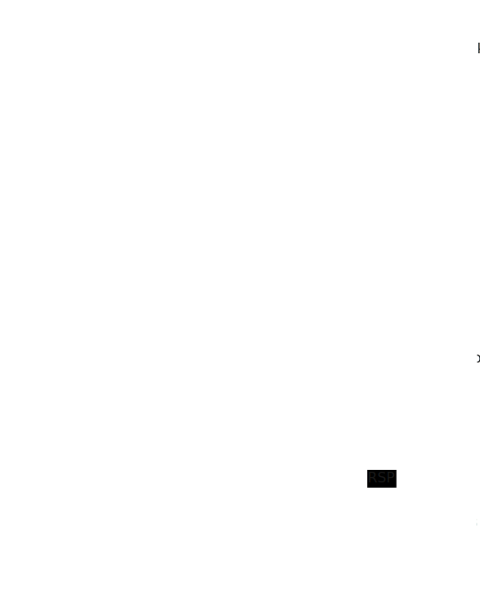

The thread stack and guard page are essential components in managing memory for threads in operating systems. The stack stores local variables, function call information, and return addresses, while the guard page serves as a safety mechanism to prevent stack overflow.

# Thread Stack Gaurd Page

- Thread Stack: A region of memory allocated for each thread to manage its execution context. It grows and shrinks dynamically as functions are called and return.
- Guard Page: A special page at the end of the stack that triggers a protection fault when accessed, signaling a potential stack overflow. This allows the system to handle or prevent crashes.

## Function for Thread Stack

The thread stack is a dedicated memory region for each thread, with default sizes varying by operating system and compiler **(Windows: 1 MB, Linux: 8 MB)**. Its key roles include:

1. **Storing Local Variables**: Local variables within functions are typically stored on the stack.
2. **Saving Return Addresses**: During function calls, return addresses are pushed onto the stack to ensure proper return after execution.
3. **Passing Parameters**: Some function parameters are passed via the stack during calls.
4. **Preserving Register States**: Register values are saved to the stack during function calls to restore them upon return.

To check the thread stack size, examine the `SizeOfStackReserve` field in the **PE header**.

# Stack Model

The thread stack grows from high addresses to low addresses, with the top referred to as the **stack top** and the bottom as the **stack bottom**. The CPU provides two registers, **ESP** and **EBP**, to track these positions:

1. **Stack Bottom**: The starting point of the current stack, pointed to by the EBP (base pointer) register.
2. **Stack Top**: The current end of the stack, pointed to by the ESP (stack pointer) register.
3. **Stack Frame**: Each function call creates a stack frame on the stack, serving as the basic unit of the thread stack.

- StackBase: The highest memory address of the thread's stack, marking the top of the allocated stack memory where the stack begins to grow downward.
- StackLimit: The boundary below which the stack should not grow without triggering a protection mechanism, often associated with the guard page to prevent overflow.
- DeallocationStack: The lowest memory address of the reserved stack region, indicating the base that can be deallocated when the thread terminates.

# In x86 return address -> params -> local var -> Method EBP 。

# In x64

In the x64 architecture, the RBP (base pointer register) in the thread stack is often omitted, especially when frame pointer omission (FPO) optimization is used. Omitting RBP can save a register for other purposes, but the trade-off is that the entire stack layout must be reconstructed in reverse using only the RSP (stack pointer).

## RBP and RSP Roles

In traditional x86/x64 calling conventions, RBP is used to maintain a fixed reference point (frame pointer) for the current stack frame, while RSP dynamically tracks the top of the stack. With FPO, compilers optimize by not setting up a full frame pointer, relying solely on RSP for stack management.

## FPO Optimization

This technique is common in performance-critical code (e.g., loops or leaf functions) where saving the RBP setup/teardown overhead improves execution speed. However, it complicates debugging and stack unwinding, as the call stack must be inferred from RSP and return addresses.

## Stack Unwinding

Without RBP, tools like debuggers or exception handlers rely on DWARF or similar debugging information to trace the stack. The RSP points to the current stack top, and return addresses (stored by CALL instructions) are used to walk back through the call chain.

## x64 Calling Convention

The x64 architecture uses a standardized calling convention (e.g., Microsoft x64 or System V AMD64), where the first few arguments are passed in registers (e.g., RDI, RSI), and the stack is 16-byte aligned. FPO aligns with this by minimizing unnecessary register usage.

## Trade-offs

While FPO saves register pressure and improves performance, it can make it harder to analyze stack overflows or corrupted stacks, as the lack of a frame pointer obscures the stack frame boundaries.

# Gaurd Page

The Guard Page is a mechanism in thread stacks that enables automatic expansion and serves as a protection against stack overflow exceptions. Its process is as follows:

- When the stack grows into the Guard Page region, the kernel triggers a STATUS_GUARD_PAGE_VIOLATION exception.
- The operating system catches this exception, allocates new stack memory pages, and moves the Guard Page to the new location.
- The thread continues execution, awaiting the next stack expansion.
- When the stack grows to within the last Reserved page **default 1MB**, a stack overflow exception **c00000fd** is triggered.

## Stack Expansion

This dynamic allocation is handled by the operating system (e.g., Windows) and is transparent to the application. It ensures the stack can grow as needed up to the reserved stack size (typically 1MB by default in Windows).

## STATUS_GUARD_PAGE_VIOLATION

This exception (0x80000001) is a controlled signal to the OS to extend the stack. The system resets the Guard Page after allocation, maintaining the protection layer.

## Stack Overflow (c00000fd)

When the stack exhausts the reserved memory (e.g., after repeated expansions), the OS can no longer allocate more pages, leading to a fatal stack overflow exception. This can be mitigated by increasing the reserved stack size during thread creation.

## Thread Stack Management

In x64 systems, this mechanism works alongside the RSP and (optionally) RBP to manage stack frames. The Guard Page complements FPO by providing runtime protection rather than relying solely on compile-time optimizations.
