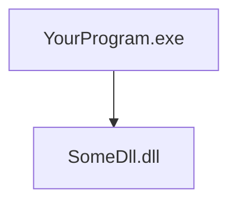
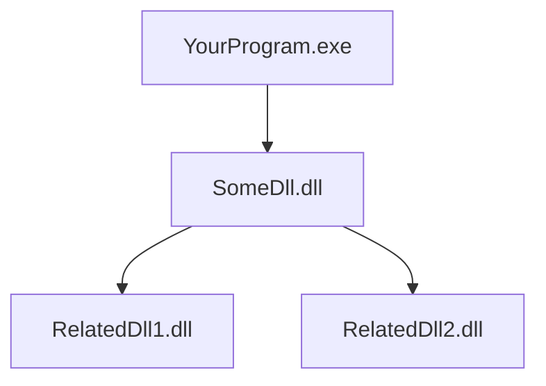

## Background

In my recent work with .NET applications, I encountered issues with the `DllImport` attribute used to call functions from an unmanaged DLL. The code snippet below illustrates a typical usage:

```cs
[DllImport(@"SomePath/SomeDll", CallingConvention = CallingConvention.Cdecl, CharSet = CharSet.Ansi)]
```

The DLL search prioritizes the application's directory first, then the `System32` folder, and subsequently the directories listed in the system's PATH environment variable. This precedence is critical to understanding why imports may fail if the DLL or its dependencies are not correctly placed.

## Issue 1: Missing Reference DLLs for the Main DLL

One common issue is missing dependent DLLs. For the main DLL (`SomeDll.dll`) to function correctly, all its referenced DLLs must reside in the same directory as the main DLL or in a location accessible via the system's PATH.

### Example Folder Structure (Incorrect)

Here’s an incorrect setup where dependent DLLs are missing:



### Correct Folder Structure

To resolve this, ensure all dependent DLLs are included in the same directory:



### Solution

Place all dependent DLLs in the same folder as `SomeDll.dll`. For example:

- YourProgram.exe
- SomeDll.dll
- RelatedDll1.dll
- RelatedDll2.dll

This ensures the runtime can locate all necessary dependencies.

## Issue 2: Architecture Mismatch

Another frequent issue is a mismatch between the target platform of the DLL and the application. If the DLL is compiled for x86, the application must also be built for x86. Similarly, x64 DLLs require an x64 build.

### Consequences of Mismatch

Running an x86 DLL in an x64 process (or vice versa) will result in a `BadImageFormatException` or failure to load the DLL.

### Solution

Ensure the application’s build target matches the DLL’s architecture. In Visual Studio, set the platform target in the project properties to either `x86` or `x64` as needed, or use `AnyCPU` with caution, ensuring the runtime environment aligns with the DLL.

## Issue 3: Incorrect Function Signature

Incorrect function signatures in the `DllImport` declaration can also cause failures. The signature in the C# code must exactly match the exported function in the DLL, including:

- Function name
- Parameter types and order
- Return type
- Calling convention

### Example of Incorrect Signature

Suppose the DLL exports a function like this in C:

```c
extern "C" __declspec(dllexport) int Add(int a, int b);
```

An incorrect C# declaration might be:

```cs
[DllImport("SomeDll.dll", CallingConvention = CallingConvention.Cdecl)]
public static extern int Add(int a); // Missing parameter
```

This will cause a runtime error due to the mismatch.

### Correct Signature

The correct declaration would be:

```cs
[DllImport("SomeDll.dll", CallingConvention = CallingConvention.Cdecl)]
public static extern int Add(int a, int b);
```

### Solution

Verify the DLL’s exported function signatures using tools like `dumpbin /exports` or Dependency Walker. Ensure the C# declaration matches the DLL’s function signature exactly, including the calling convention (`Cdecl`, `StdCall`, etc.) and character set (`CharSet.Ansi` or `CharSet.Unicode`).

## Summary

To avoid `DllImport` failures:

1. **Ensure all dependent DLLs** are in the same directory as the main DLL or in the system PATH.
2. **Match the architecture** of the DLL and the application (x86 or x64).
3. **Verify function signatures** to ensure they align with the DLL’s exported functions.
