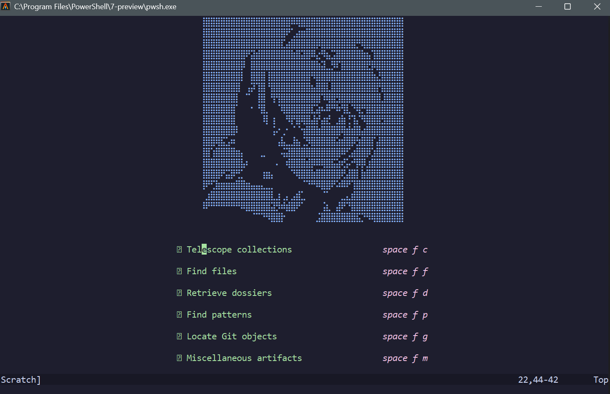
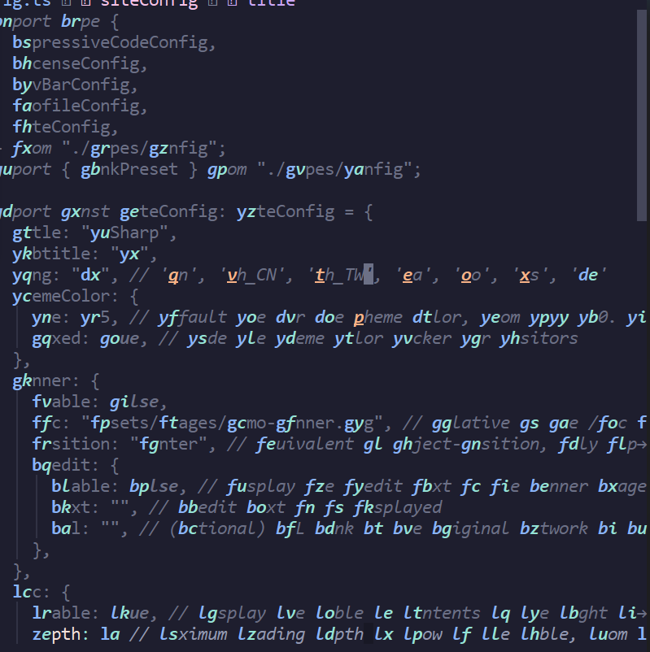
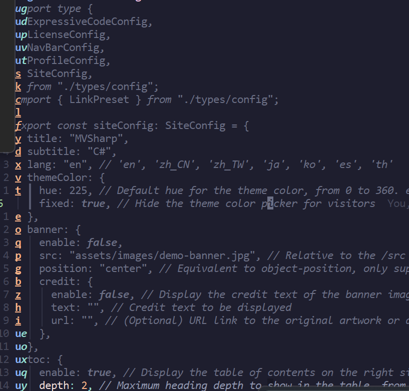
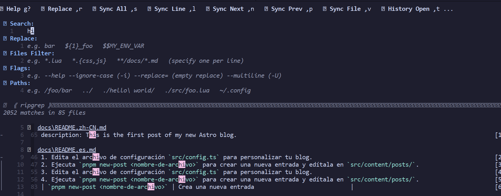
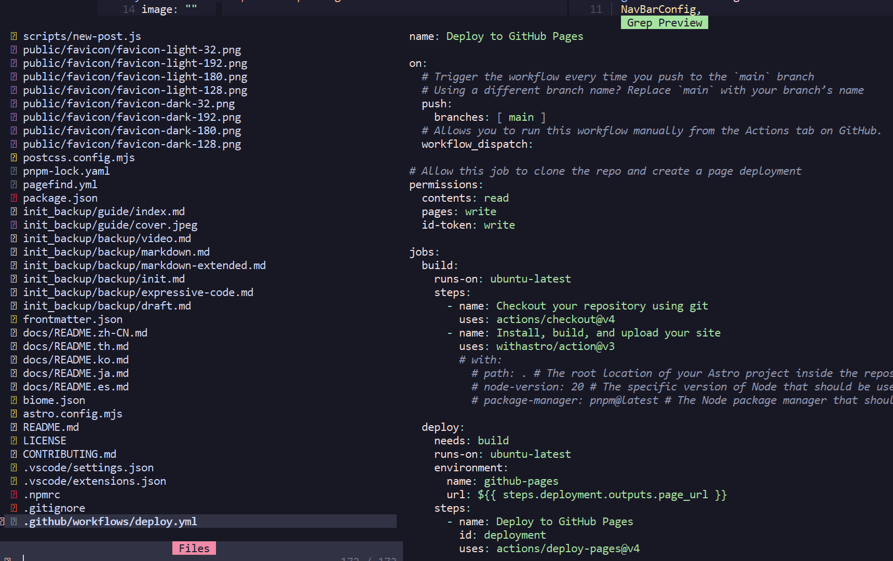

::github{repo="ayamir/nvimdots"}
:::Tip
Reach out Neovimdots from [neovimdots](https://github.com/ayamir/nvimdots) by [ayamir](https://github.com/ayamir)
:::

# Common Ops

Here are some frequently used operations in Neovimdots to streamline your editing workflow:

## File Explorer

To open the file explorer within Neovimdots, use the following keybindings in normal mode:

- **Ctrl + n**: Open the file explorer.
- **Ctrl + h**: Switch to the file explorer if already open.
- **Ctrl + t**: Open the selected file in a new tab.
- **Ctrl + v**: Open the selected file in a vertical split.

## Terminal

To toggle and interact with the terminal:

- \*\*Ctrl + \*\*: Open the terminal.
- **A**: Enter insert mode in the terminal for typing commands.

## Window Navigation

Navigate between windows using Vim-style directional keybindings:

- **Ctrl + h/j/k/l**: Move to the window in the direction of h (left), j (down), k (up), or l (right).

## Fast Navigation

Quickly move through code or text:

- **Space + w**: Jump to the next word.
- **Space + j**: Jump to the next line.

## Replace Occurrences

Perform text replacement across the project:

- **Space + S + s**: Use ripgrep to search and replace occurrences in files.

## Telescope

Access Telescope for powerful fuzzy finding and navigation:

- **Space + f**: Open Telescope, then select from available operations (e.g., find files, live grep, or buffers).

# nvimdots Keybindings Cheat Sheet

The default `<leader>` key is `<Space>`. Keybindings are grouped by functionality based on mappings from `lua/keymap/completion.lua`, `lua/keymap/lang.lua`, `lua/keymap/init.lua`, and related plugins.

## Keybinding Notation

- **Modes**: `normal`, `insert`, `visual`, `terminal`, `command`, `operator`
- **Shortcuts**: `Ctrl + x` (simultaneous), `Alt + x` (simultaneous), `space + x + y` (sequential)
- **Access**: Use `Ctrl + p` (normal mode) or `:WhichKey` (command mode) to explore keymaps.

## General Editing

| Mode    | Shortcut        | Description                   |
| ------- | --------------- | ----------------------------- |
| normal  | Ctrl + s        | Save file                     |
| normal  | Ctrl + q        | Save file and quit            |
| normal  | Alt + Shift + q | Force quit                    |
| insert  | Ctrl + u        | Delete previous block         |
| insert  | Ctrl + b        | Move cursor to left           |
| insert  | Ctrl + a        | Move cursor to line start     |
| insert  | Ctrl + s        | Save file                     |
| insert  | Ctrl + q        | Save file and quit            |
| command | Ctrl + b        | Move cursor left              |
| command | Ctrl + f        | Move cursor right             |
| command | Ctrl + a        | Move cursor to start          |
| command | Ctrl + e        | Move cursor to end            |
| command | Ctrl + d        | Delete character              |
| command | Ctrl + h        | Backspace                     |
| command | Ctrl + t        | Complete path of current file |
| visual  | J               | Move selected line down       |
| visual  | K               | Move selected line up         |
| visual  | <               | Decrease indent               |
| visual  | >               | Increase indent               |
| normal  | Y               | Yank text to end of line      |
| normal  | D               | Delete text to end of line    |
| normal  | n               | Go to next search result      |
| normal  | N               | Go to previous search result  |
| normal  | J               | Join next line                |
| normal  | Shift + Tab     | Toggle code fold              |
| normal  | Esc             | Clear search highlight        |
| normal  | space + o       | Toggle spell check            |
| normal  | Alt + s         | Save file using sudo          |

## Buffer and Tab Management

| Mode   | Shortcut        | Description                 |
| ------ | --------------- | --------------------------- |
| normal | space + b + n   | Create new buffer           |
| normal | Alt + q         | Close current buffer        |
| normal | Alt + i         | Switch to next buffer       |
| normal | Alt + o         | Switch to previous buffer   |
| normal | Alt + Shift + i | Move current buffer to next |
| normal | Alt + Shift + o | Move current buffer to prev |
| normal | Alt + 1         | Go to buffer 1              |
| normal | Alt + 2         | Go to buffer 2              |
| normal | Alt + 3         | Go to buffer 3              |
| normal | Alt + 4         | Go to buffer 4              |
| normal | Alt + 5         | Go to buffer 5              |
| normal | Alt + 6         | Go to buffer 6              |
| normal | Alt + 7         | Go to buffer 7              |
| normal | Alt + 8         | Go to buffer 8              |
| normal | Alt + 9         | Go to buffer 9              |
| normal | space + b + e   | Sort buffers by extension   |
| normal | space + b + d   | Sort buffers by directory   |
| normal | t + n           | Create new tab              |
| normal | t + k           | Move to next tab            |
| normal | t + j           | Move to previous tab        |
| normal | t + o           | Keep only current tab       |

## Window Management

| Mode   | Shortcut      | Description           |
| ------ | ------------- | --------------------- |
| normal | Alt + h       | Resize window left    |
| normal | Alt + j       | Resize window down    |
| normal | Alt + k       | Resize window up      |
| normal | Alt + l       | Resize window right   |
| normal | Ctrl + h      | Focus left window     |
| normal | Ctrl + j      | Focus down window     |
| normal | Ctrl + k      | Focus up window       |
| normal | Ctrl + l      | Focus right window    |
| normal | space + W + h | Move window leftward  |
| normal | space + W + j | Move window downward  |
| normal | space + W + k | Move window upward    |
| normal | space + W + l | Move window rightward |

## Terminal

| Mode     | Shortcut      | Description                |
| -------- | ------------- | -------------------------- |
| normal   | Ctrl + \      | Toggle horizontal terminal |
| insert   | Ctrl + \      | Toggle horizontal terminal |
| terminal | Ctrl + \      | Toggle horizontal terminal |
| normal   | Alt + \       | Toggle vertical terminal   |
| insert   | Alt + \       | Toggle vertical terminal   |
| terminal | Alt + \       | Toggle vertical terminal   |
| normal   | F5            | Toggle vertical terminal   |
| insert   | F5            | Toggle vertical terminal   |
| terminal | F5            | Toggle vertical terminal   |
| normal   | Alt + d       | Toggle floating terminal   |
| insert   | Alt + d       | Toggle floating terminal   |
| terminal | Alt + d       | Toggle floating terminal   |
| terminal | Esc + Esc     | Switch to normal mode      |
| terminal | Ctrl + w + h  | Focus left window          |
| terminal | Ctrl + w + j  | Focus down window          |
| terminal | Ctrl + w + k  | Focus up window            |
| terminal | Ctrl + w + l  | Focus right window         |
| normal   | space + g + g | Toggle lazygit in terminal |

## Completion

| Mode    | Shortcut    | Description                              |
| ------- | ----------- | ---------------------------------------- |
| insert  | Ctrl + p    | Select previous completion item          |
| insert  | Ctrl + n    | Select next completion item              |
| insert  | Ctrl + d    | Scroll documentation up                  |
| insert  | Ctrl + f    | Scroll documentation down                |
| insert  | Ctrl + w    | Abort completion                         |
| insert  | Tab         | Select next completion or expand snippet |
| insert  | Shift + Tab | Select previous completion or jump back  |
| insert  | Enter       | Confirm completion                       |
| select  | Enter       | Confirm completion                       |
| command | Enter       | Confirm completion                       |

## LSP (Language Server Protocol)

| Mode   | Shortcut      | Description                       |
| ------ | ------------- | --------------------------------- |
| normal | space + l + i | Show LSP info                     |
| normal | space + l + r | Restart LSP                       |
| normal | g + o         | Toggle symbol outline (trouble)   |
| normal | g + t + o     | Toggle symbol outline (Telescope) |
| normal | g + [         | Go to previous diagnostic         |
| normal | g + ]         | Go to next diagnostic             |
| normal | space + l + x | Show line diagnostics             |
| normal | g + s         | Show signature help               |
| normal | g + r         | Rename in file range              |
| normal | g + R         | Rename in project range           |
| normal | K             | Show documentation                |
| normal | g + a         | Perform code action               |
| visual | g + a         | Perform code action               |
| normal | g + d         | Preview definition                |
| normal | g + D         | Go to definition                  |
| normal | g + h         | Show references                   |
| normal | g + m         | Show implementation               |
| normal | g + c + i     | Show incoming calls               |
| normal | g + c + o     | Show outgoing calls               |
| normal | space + l + v | Toggle virtual text display       |
| normal | space + l + h | Toggle inlay hints display        |
| normal | g + t         | Toggle trouble diagnostics list   |
| normal | space + l + w | Show workspace diagnostics        |
| normal | space + l + p | Show project diagnostics          |
| normal | space + l + d | Show document diagnostics         |

## Git

| Mode     | Shortcut      | Description                               |
| -------- | ------------- | ----------------------------------------- |
| normal   | space + g + d | Show Git diff                             |
| normal   | space + g + D | Close Git diff                            |
| normal   | g + p + s     | Git push                                  |
| normal   | g + p + l     | Git pull                                  |
| normal   | space + g + G | Open git-fugitive                         |
| normal   | ] + g         | Go to next Git hunk                       |
| normal   | [ + g         | Go to previous Git hunk                   |
| normal   | space + g + s | Toggle staging/unstaging of hunk          |
| visual   | space + g + s | Toggle staging/unstaging of selected hunk |
| normal   | space + g + r | Reset hunk                                |
| visual   | space + g + r | Reset selected hunk                       |
| normal   | space + g + R | Reset buffer                              |
| normal   | space + g + p | Preview hunk                              |
| normal   | space + g + b | Blame line                                |
| operator | i + h         | Select Git hunk                           |

## Search and Replace

| Mode   | Shortcut      | Description                                |
| ------ | ------------- | ------------------------------------------ |
| normal | space + S + s | Toggle search & replace panel              |
| normal | space + S + p | Search and replace current word (project)  |
| visual | space + S + p | Search and replace selected text (project) |
| normal | space + S + f | Search and replace in current file         |

## Telescope

| Mode   | Shortcut      | Description                  |
| ------ | ------------- | ---------------------------- |
| normal | Ctrl + p      | Toggle command panel         |
| normal | space + f + c | Open Telescope collections   |
| normal | space + f + f | Find files                   |
| normal | space + f + p | Find patterns                |
| visual | space + f + s | Find selected text           |
| normal | space + f + g | Locate Git objects           |
| normal | space + f + d | Retrieve dossiers            |
| normal | space + f + m | Miscellaneous search         |
| normal | space + f + r | Resume last Telescope search |
| normal | space + f + R | Resume last fzf-lua search   |

## File Explorer

| Mode   | Shortcut      | Description           |
| ------ | ------------- | --------------------- |
| normal | Ctrl + n      | Toggle filetree       |
| normal | space + n + f | Find file in NvimTree |
| normal | space + n + r | Refresh NvimTree      |

## Debugging

| Mode   | Shortcut      | Description                   |
| ------ | ------------- | ----------------------------- |
| normal | F6            | Run/Continue debugging        |
| normal | F7            | Stop debugging                |
| normal | F8            | Toggle breakpoint             |
| normal | F9            | Step into                     |
| normal | F10           | Step out                      |
| normal | F11           | Step over                     |
| normal | space + d + b | Set breakpoint with condition |
| normal | space + d + c | Run to cursor                 |
| normal | space + d + l | Run last debugging session    |
| normal | space + d + o | Open DAP REPL                 |

## Code Execution

| Mode   | Shortcut  | Description       |
| ------ | --------- | ----------------- |
| normal | space + r | Run code by file  |
| visual | space + r | Run selected code |

## CodeCompanion

| Mode   | Shortcut      | Description                         |
| ------ | ------------- | ----------------------------------- |
| normal | space + c + s | Select Chat Model                   |
| normal | space + c + c | Toggle CodeCompanion                |
| visual | space + c + c | Toggle CodeCompanion                |
| normal | space + c + k | CodeCompanion actions               |
| visual | space + c + a | Add selection to CodeCompanion chat |

## Markdown Preview

| Mode   | Shortcut | Description                       |
| ------ | -------- | --------------------------------- |
| normal | F1       | Toggle markdown preview in Neovim |
| normal | F12      | Toggle markdown preview (browser) |

## Sessions

| Mode   | Shortcut      | Description          |
| ------ | ------------- | -------------------- |
| normal | space + s + s | Save session         |
| normal | space + s + l | Load current session |
| normal | space + s + d | Delete session       |

## Commenting

| Mode   | Shortcut  | Description                          |
| ------ | --------- | ------------------------------------ |
| normal | g + c + c | Toggle comment for line              |
| normal | g + b + c | Toggle comment for block             |
| normal | g + c     | Toggle comment for line (operator)   |
| normal | g + b     | Toggle comment for block (operator)  |
| visual | g + c     | Toggle comment for line (selection)  |
| visual | g + b     | Toggle comment for block (selection) |

## Navigation

| Mode     | Shortcut  | Description                |
| -------- | --------- | -------------------------- |
| normal   | space + w | Jump to word               |
| normal   | space + j | Jump to line               |
| normal   | space + k | Jump to line               |
| normal   | space + c | Jump to one character      |
| normal   | space + C | Jump to two characters     |
| visual   | space + w | Jump to word               |
| visual   | space + j | Jump to line               |
| visual   | space + k | Jump to line               |
| visual   | space + c | Jump to one character      |
| visual   | space + C | Jump to two characters     |
| operator | m         | Operate across syntax tree |
