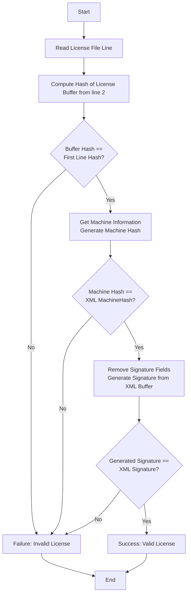

:::CAUTION
Sensitive information has been masked for educational purposes only.
:::

## Initial Observations

The reverse engineering process begins with examining the application's folder structure to gather initial insights.

### Directory Structure

Key files observed:

- System.IO.Compression.FileSystem.dll
- System.IO.Packaging.dll
- System.Memory.dll
- System.Net.Http.dll
- Engine.exe
- License.dll
- Additional files...

The presence of these files suggests the application is built on the .NET framework.

## Initial Analysis with dnSpy

To dive deeper, we load `License.dll` and `Engine.exe` into dnSpy, a powerful .NET decompiler and debugger.


1. Set a breakpoint at the application's entry point by pressing **F5** and navigating to **Break At -> Entry Point**.
2. The entry point reveals the application is a WPF (Windows Presentation Foundation) application, indicated by references to `PresentationBuildTasks`.
3. The code appears heavily obfuscated, with cryptic naming and altered control flow.
4. Metadata inspection reveals the use of **Dotfuscator** for obfuscation, as indicated by:
   ```xml
   [assembly: AssemblyAssociatedContentFile("dotf****torconfig.xml")]
   ```
   This obfuscation makes the code challenging to interpret directly.

## Behavioral Analysis with Process Explorer

Since the application supports offline activation, we analyze its runtime behavior to uncover key operations:

- Retrieves the machine UUID from `SOFTWARE\Microsoft\Cryptography`.
- Obtains the disk serial number using `ManagementBaseObject`.
- Fetches the system UUID via `ManagementObjectCollection`.


By setting breakpoints at these functions, we identify their roles in the application. Using dnSpy's **Right Click -> Analyze -> Used By** feature, we locate a hash function critical to the activation process.


## Deep Dive into the Hash Function


The hash function is not directly responsible for generating the activation code but is used to verify the integrity of the license content. By setting a breakpoint at this function and running the debugger (F5), we inspect the **Locals** view in dnSpy to examine the license structure.

### License Content Structure


By observing A_0 , we find out it is a xml
The license is an XML file containing:

- **guid**: Unique identifier
- **Expire**: License expiration date
- **MachineHash**: Hash generated by the identified function
- **Signature**: Used for integrity verification

:::CAUTION
Full license details are masked for educational purposes.
:::

## Investigating the Signature


The license includes a **Signature** field, likely used to detect modifications to the XML content. During analysis, we identify a static constructor containing an unusual Base64 string, which appears to be a public key used for signature verification.


The verification process follows this flow:

1. Remove the signature element from the XML to obtain the content buffer.
2. Initialize a signer with the public key (Base64 string).
3. Perform a verification check to ensure the content has not been altered.


If the verification fails, the application throws an exception:

```csharp
throw new Exception("Invalid Signature");
```

## Identify the algorthimn from Public Key

```cs
// put it from upper step
var oripubcKey =PublicKeyFactory.CreateKey(Convert.FromBase64String(publickeybase64));

if (oripubcKey is ECPublicKeyParameters ecPublicKey)
{
    var curve = ecPublicKey.Parameters.Curve;
    var order = ecPublicKey.Parameters.N;
    var fieldSize = curve.FieldSize;

    Console.WriteLine("Curve field size: " + fieldSize);
    Console.WriteLine("Curve order (n): " + order);
```

:::Tip
left this answer found by reader
:::

# Summaries the flow


