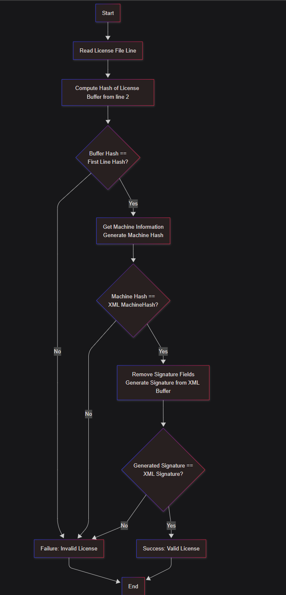

:::CAUTION
This content is for educational purposes only. Sensitive information has been anonymized to comply with ethical and legal standards.
:::

# Series

- [Part 1](./part1.md) Understand the license activation flow
- [Part 2](./part2.md) We write our own keygen
- [Bonus](./part3.md) Bonus , Decryt the connection string for sqlite

# Background

Diving into the gritty world of reverse engineering, I’m tearing apart the license activation flow of a .NET-based system packed with License Management Services, LicenseActivation.dll, AppEngineSDK.dll, and Products A, B, and C. These components lean hard on LicenseActivation.dll for license checks, while the products also tap AppEngineSDK.dll for their core juice. My mission? Rip open the black box of license validation, map out its secrets, and expose any weak spots. Using tools like dnSpy and Process Explorer, I’m hunting for the hash functions and UUID checks that guard the system, aiming to outsmart the obfuscation and own the activation process.

:::Tips
Some other services will introduce for later series
For part 1 series , we just activate the program for futher debugging.
:::
This diagram shows that License Management Services and all products (A, B, C) depend on **LicenseActivation.dll**, while **Products A, B, and C** additionally depend on **AppEngineSDK.dll**.
Everytime AppEngineSDK init , it call License Check.

## Initial Observations

The reverse engineering process begins with examining the application's folder structure to gather initial insights.

### Tools Presuite

- Dnspy
- Process Explorer
- Detect It Easy

### Directory Structure

Key files observed:

- System.IO.Compression.FileSystem.dll
- System.IO.Packaging.dll
- System.Memory.dll
- System.Net.Http.dll
- Engine.exe
- License.dll
- Additional files...

The presence of these files suggests the application is built on the .NET framework.

:::Tip
You can use DetectItEasy or directly drag and drop to dnspy.
:::

## Initial Analysis with dnSpy

To dive deeper, we load `License activation.dll` and `ProductAEngine.exe` into dnSpy, a powerful .NET decompiler and debugger.
:::Important
Please note the application is 32bit or 64it to choose correct version of dnspy
:::

1. Set a breakpoint at the application's entry point by pressing **F5** and navigating to **Break At -> Entry Point**.


2. The entry point reveals the application is a WPF (Windows Presentation Foundation) application, indicated by references to `PresentationBuildTasks`.
3. The code appears heavily obfuscated, with cryptic naming and altered control flow.
4. Metadata inspection reveals the use of **Dotfuscator** for obfuscation, as indicated by:
   ```xml
   [assembly: AssemblyAssociatedContentFile("dotfuscatorconfig.xml")]
   ```
   This obfuscation makes the code challenging to interpret directly.

## Behavioral Analysis with Process Explorer

Since the application supports offline activation, we analyze its runtime behavior to uncover key operations:

- Retrieves the machine UUID from `SOFTWARE\Microsoft\Cryptography`.
- Obtains the disk serial number using `ManagementBaseObject`.
- Fetches the system UUID via `ManagementObjectCollection`.

By setting breakpoints at these functions, we identify their roles in the application. Using dnSpy's **Right Click -> Analyze -> Used By** feature, we locate a hash function critical to the activation process.

we found

For these three function , They will be concat together then as a MD5 hash.


# Not that Easy

Do we already got the License , the sad things is **NO**


The hash function is not directly responsible for generating the `activation code` but is used to verify the integrity of the license content. By setting a breakpoint at this function and running the debugger (F5), we inspect the **Locals** view in dnSpy to examine the license structure.
we found this function **public static LicenseStatus q(string A_0, string A_1)**
Simply used to get the licenseStatus

```cs
public static LicenseStatus q(string A_0, string A_1)
	{
		short num = (short)598671360;
		int num2 = (int)num;
		switch (num2)
		{
		default:
		{
			switch (0)
			{
			case 0:
				goto IL_009A;
			}
			i i;
			for (;;)
			{
				IL_0027:
				f f;
				DateTime? dateTime3;
				switch (num2)
				{
				case 0:
				{
					bool flag;
					if (flag)
					{
						num = (short)995950594;
						num2 = (int)((IntPtr)num);
						continue;
					}
					goto IL_0280;
				}
				case 1:
					num = (short)1752170497;
					if (num != 0)
					{
					}
					num = (short)791609355;
					num2 = (int)((IntPtr)num);
					continue;
				case 2:
					num = (short)784072727;
					num2 = (int)((IntPtr)num);
					continue;
				case 3:
				{
					bool flag = false;
					num = (short)701759508;
					num2 = (int)((IntPtr)num);
					continue;
				}
				case 4:
					if (!i.m(global::s.t))
					{
						num = (short)331939852;
						num2 = (int)((IntPtr)num);
						continue;
					}
					f = i.j();
					num = (short)702283797;
					num2 = (int)((IntPtr)num);
					continue;
				case 5:
				{
					string text;
					if (!string.IsNullOrWhiteSpace(text))
					{
						num = (short)310837251;
						num2 = (int)((IntPtr)num);
						continue;
					}
					goto IL_03E2;
				}
				case 6:
				{
					num = (short)784471997;
					short num3 = num;
					num = (short)313989053;
					switch ((num3 == num) ? 1 : 0)
					{
					case 0:
					case 2:
						goto IL_0326;
					default:
					{
						num = (short)1800732672;
						if (num != 0)
						{
						}
						DateTime dateTime2;
						int num4;
						DateTime dateTime = dateTime2.AddDays((double)num4);
						num = (short)322830344;
						num2 = (int)((IntPtr)num);
						continue;
					}
					}
					break;
				}
				case 7:
					if (dateTime3 != null)
					{
						num = (short)408682518;
						num2 = (int)((IntPtr)num);
						continue;
					}
					return LicenseStatus.MissingMaintenanceExpirationDate;
				case 8:
				{
					DateTime dateTime;
					DateTime date;
					if (dateTime.Date >= date)
					{
						num = (short)1796145153;
						num2 = (int)((IntPtr)num);
						continue;
					}
					return LicenseStatus.Expired;
				}
				case 9:
				{
					string text2 = global::s.h();
					string text = f.y("MachineId");
					num = (short)1854341125;
					num2 = (int)((IntPtr)num);
					continue;
				}
				case 10:
					return LicenseStatus.InvalidProductName;
				case 11:
				{
					DateTime date;
					DateTime dateTime4;
					if (dateTime4.Date < date)
					{
						num = (short)1463549968;
						num2 = (int)((IntPtr)num);
						continue;
					}
					return LicenseStatus.GracePeriod;
				}
				case 12:
					return LicenseStatus.NotActivated;
				case 13:
					return LicenseStatus.InvalidMAC;
				case 14:
				{
					int num4 = 0;
					num = (short)1371078673;
					num2 = (int)((IntPtr)num);
					continue;
				}
				case 15:
				{
					DateTime dateTime = i.m();
					DateTime dateTime2 = dateTime.ToUniversalTime();
					dateTime = DateTime.Now;
					DateTime date = dateTime.Date;
					num = (short)1773142040;
					num2 = (int)((IntPtr)num);
					continue;
				}
				case 16:
					return LicenseStatus.NoUpdates;
				case 17:
				{
					int num4;
					if (int.TryParse(f.y("GracePeriod"), out num4))
					{
						num = (short)629997574;
						num2 = (int)((IntPtr)num);
						continue;
					}
					return LicenseStatus.Expired;
				}
				case 18:
					return LicenseStatus.InvalidMachineId;
				case 19:
				{
					DateTime date;
					DateTime dateTime4;
					if (dateTime4.Date < date)
					{
						num = (short)1758461977;
						num2 = (int)((IntPtr)num);
						continue;
					}
					return LicenseStatus.Activated;
				}
				case 20:
				{
					string text;
					string text2;
					if (text != text2)
					{
						goto IL_0326;
					}
					goto IL_03E2;
				}
				case 21:
				{
					if (f.y("ProductName") != A_1)
					{
						num = (short)1708392458;
						num2 = (int)((IntPtr)num);
						continue;
					}
					bool flag = true;
					num = (short)1785856026;
					num2 = (int)((IntPtr)num);
					continue;
				}
				case 22:
				{
					DateTime dateTime = dateTime3.Value;
					DateTime dateTime4 = dateTime.ToUniversalTime();
					num = (short)1768357903;
					num2 = (int)((IntPtr)num);
					continue;
				}
				case 23:
					if (!global::s.t(false).Contains(f.y("MAC")))
					{
						num = (short)1527513101;
						num2 = (int)((IntPtr)num);
						continue;
					}
					goto IL_0280;
				case 24:
				{
					DateTime dateTime2;
					DateTime date;
					if (dateTime2.Date < date)
					{
						num = (short)925171726;
						num2 = (int)((IntPtr)num);
						continue;
					}
					num = (short)1913913363;
					num2 = (int)((IntPtr)num);
					continue;
				}
				case 25:
					return LicenseStatus.NoUpdates;
				case 26:
					if (f.v("MachineId"))
					{
						num = (short)881917961;
						num2 = (int)((IntPtr)num);
						continue;
					}
					goto IL_03E2;
				}
				goto IL_009A;
				IL_0280:
				dateTime3 = i.v(f.y("MaintenanceExpirationDate"));
				num = (short)1303969792;
				short num5 = num;
				num = (short)608436231;
				num2 = (int)((IntPtr)num);
				continue;
				IL_0326:
				num = (short)1130364946;
				num2 = (int)((IntPtr)num);
				continue;
				IL_03E2:
				num = (short)701693952;
				num2 = (int)((IntPtr)num);
			}
			return LicenseStatus.NotActivated;
			IL_009A:
			i = i.p(A_0);
			num = (short)828964868;
			num2 = (int)((IntPtr)num);
			goto IL_0027;
		}
		}
	}
```

License Status can be

```cs
public enum LicenseStatus
	{
		NotActivated,
		Activated,
		NoUpdates,
		GracePeriod,
		Expired,
		InvalidProductName,
		InvalidMAC,
		InvalidMachineId,
		MissingMaintenanceExpirationDate
	}
```

This function is heavily obfuscated, exhibiting complex control flow. To tackle this:

- **Use de4dot**: Attempt deobfuscation with de4dot, a popular .NET deobfuscator.
- **Custom Deobfuscator**: If de4dot fails, write a custom control flow deobfuscator.
- **Manual Debugging**: Attach to the target process and set breakpoints to trace execution step-by-step.
- **Leverage LLMs**: Use large language models to assist in cleaning obfuscated code.

Solution 1 employs contemporary obfuscation techniques, but many of the latest obfuscators have become ineffective over time, you may need some guys motified **de4dot**. For Solution 2, we plan to create a proof of concept in a subsequent series to demonstrate its viability with **dnlib** , **de4dot.dll**. Solution 3 demands a methodical and patient approach, requiring users to carefully work through each step to achieve a successful breakthrough. Meanwhile, Solution 4 adopts a thoroughly modern strategy, highly effective as long as sufficient **tokens** and **money** are available to support its implementation.
Ok , I understand this is quite of headache for this kinds of Cflow , thx dotofuscator , for this function  
What it does:

- Extract Fields in xml
- Expiry time check
- Mashine hash check
- Machine Name check
- Mac address check
- sigurature tamper check
- features enabled

Below is the flow illustrated


### Breakpoint To the Params

1. Set a breakpoint at the start of `LicenseStatus q(string A_0, string A_1)`.
   
   Press _F5_ , Now at **Locals** windows in dnspy  
   
2. Inspect the **Locals** window in dnSpy to analyze the parameters:
   - `A_0`: An XML string containing the license content.
   - `A_1`: The product name.
     So far so good , at least we finally know what it looks like.

### License Content Structure

so now for **A_0** string

```xml
<License>
	<Id>just guid </Id>
	<Type>license type </Type>
	<Expiration>2067-10-24</Expiration>
	<ProductFeatures>
		<Feature name=\"Product A\" />
		<Feature name=\"Product B\" />
		<Feature name=\"Product C\" />
	</ProductFeatures>
	<LicenseAttributes>
		<Attribute name=\"MachineName\"></Attribute>
		<Attribute name=\"MAC\"></Attribute>
		<Attribute name=\"MaintenanceExpirationDate\"></Attribute>
		<Attribute name=\"ProductName\"></Attribute>
		<Attribute name=\"MachineId\"></Attribute> <!-- Hash of machine UUID, disk, and system UUID -->
	</LicenseAttributes>
	<Signature>Base 64 string </Signature> <!-- Signature of XML content (excluding signature) -->
</License>
```

:::Tip
the xml I provided is formatted ,It should be minified during processing
:::

- **guid**: Unique identifier
- **Expire**: License expiration date
- **MachineId**: Hash generated by the identified function
- **Signature**: Used for integrity verification

The next critical step is understanding how the signature is generated to create a valid license.

## Investigating the Signature

The `Signature` field ensures the license XML has not been tampered with. During analysis, we discover a static constructor containing a Base64-encoded public key used for signature verification.


During analysis, we identify a static constructor containing an unusual Base64 string, which appears to be a public key used for signature verification.


The verification process follows this flow:

1. Remove the signature element from the XML to obtain the content buffer.
2. Initialize a signer with the public key (Base64 string).
3. Perform a verification check to ensure the content has not been altered.


If the verification fails, the application throws an exception:

```csharp
throw new Exception("Invalid Signature");
```


there is a good [article](https://scryptplatform.medium.com/sign-without-knowing-the-private-key-in-ecdsa-ca7411098c92) explain how it works.
So we need to know what **Signer** and **Digest** It used.
As .NET one of the most famous encrytion lib bouncycastle has a clean [document](https://www.bouncycastle.org/documentation/documentation-c/) state that

## Identify the algorthimn from Public Key

We can guess out what algorthimn it is used by knowing the Curve field and Curve Order
Now we copy the **public key** to below code

```cs
// put it from upper step
var oripubcKey =PublicKeyFactory.CreateKey(Convert.FromBase64String(publickeybase64));

if (oripubcKey is ECPublicKeyParameters ecPublicKey)
{
    var curve = ecPublicKey.Parameters.Curve;
    var order = ecPublicKey.Parameters.N;
    var fieldSize = curve.FieldSize;

    Console.WriteLine("Curve field size: " + fieldSize);
    Console.WriteLine("Curve order (n): " + order);
```

By examining the curve field and order, we can deduce the cryptographic algorithm (e.g., ECDSA) used for signature verification.
:::Tip
left this answer found by reader
hints :

- Dsa
- ECDsa
- SHA
  for sizes , you can try out different size of **SHA** to get the length of the base64String
  Then you got the answer.
  :::

# Summaries the flow

The license activation process can be summarized as follows:

1. The application retrieves machine-specific identifiers (machine UUID, disk serial, system UUID).
2. These identifiers are concatenated and hashed using MD5 to generate the `MachineId`.
3. The license XML, containing the `MachineId`, product features, and other attributes, is verified using a Base64-encoded signature.
4. A public key (embedded in the application) is used to validate the signature, ensuring the license has not been modified.



## Next Steps

In this first part, we’ve laid the groundwork for reverse engineering the .NET application’s license activation process. We’ve identified the key components, analyzed the license structure, and uncovered the role of the signature verification process.

**Stay tuned for more insights into reverse engineering .NET applications!**
