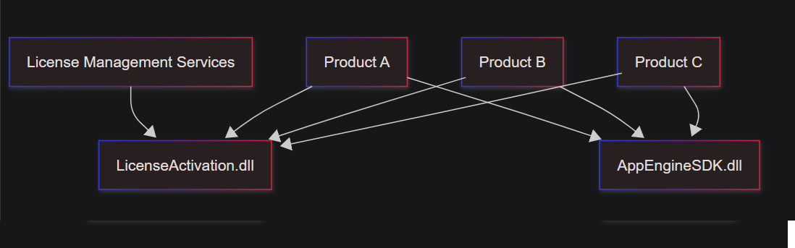
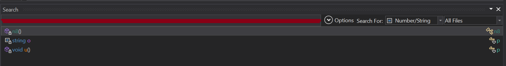
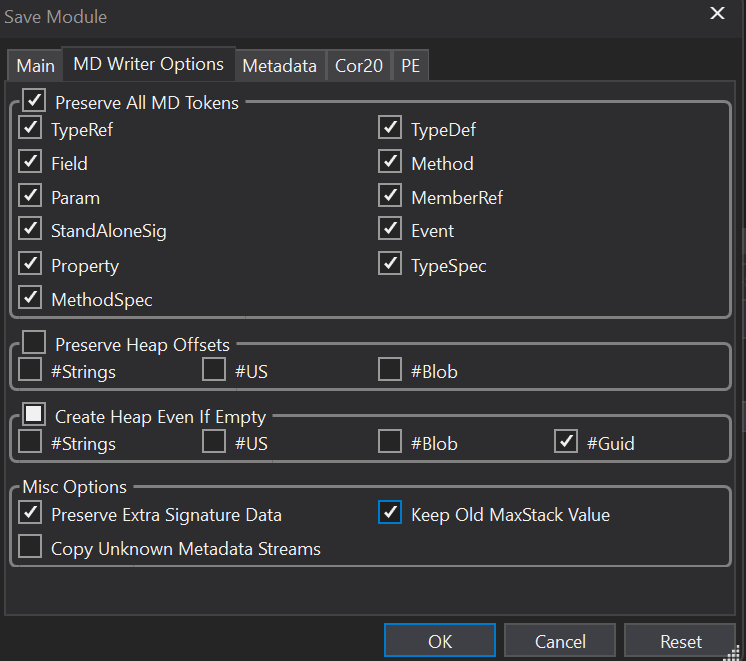
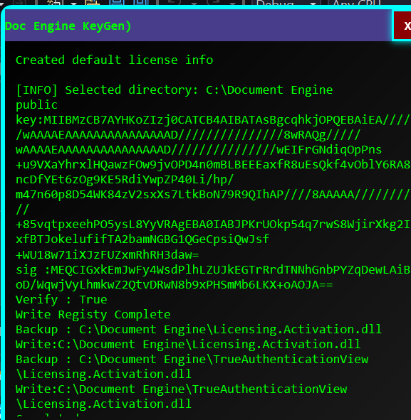

:::CAUTION
This content is for educational purposes only. Sensitive information has been anonymized to comply with ethical and legal standards.
:::

# Series

- [Part 1](./part1.md) Understand the license activation flow
- [Part 2](./part2.md) We write our own keygen
- [Bonus](./part3.md) Bonus , Decryt the connection string for sqlite

# Background

Building on the foundation laid in [Part.1](./part1.md) where we unraveled the intricacies of the activation flow, Part 2 dives into the exciting challenge of crafting a keygen to patch the application. Get ready to explore the art of reverse engineering as we unlock new techniques to bypass restrictions and gain deeper control over the software's core mechanics.
There are two ideas how we arhieve this

- **IL patch** the public key string
- **Inline hook** to patch the activation function
  :::Tip
  for hooking in .net , we can use [HarmonyLib](https://github.com/pardeike/Harmony)
  :::

## Why not use Inline hook

I’m a dev who’s all about making users stoked. Gotta keep things real from the user’s vibe.

- For **inline hooks**, we’re basically sneaking into the app’s starting point and throwing in a **jmp** to our own code. So, if users wanna fire up an activated app, they gotta roll with our DLL injector launcher. Sneaky, but slick.
- For **IL patching**, we swap the public key for one we cooked up ourselves. Users can yeet our keygen into the **Recycle Bin** if they want, but joke’s on them—they’ll need it again every time they renew a license. Hence the **Recycle Bin** wink. 😉

Ok sorry lets be serious
It is because if we are using **inline hook** we have to patch each **product** one by one such logic

```cs
if( license.IsNotActivated)
```

wait !!! what **products** ? In [Part 1](./part1.md) we do have the diagram

so patching **License.Activation.dll** is a better solution since it Fuck them all at once.

## Before We Dive In

Let’s rewind to [Part 1](./part1.md), where we mapped out the activation flow like a treasure hunt. Now, we’re flipping the script to create our keygen by working backward through the process.

### The Reverse Heist: Understanding the Flow

Picture this: the app creates a license XML file, unsigned, like a blank canvas. Then, it generates an `AsymmetricCipherKeyPair`, spitting out a public and private key. The private key signs the XML, and that signature gets tucked into the XML as an element. The updated XML is stashed in the system registry, and finally, the `License.Activation.dll` gets patched with the public key to seal the deal. Our mission? Reverse-engineer this flow to craft a keygen that generates valid keys and patches the DLL.



## Let’s Get Hacking!

We’re going all-in on **IL Patching** for this adventure. Our goal: hunt down every instance of the public key in the app’s code and replace it with our own. Let’s fire up **dnSpy** and get to work.

### NuGet

NuGet packages:

- [dnlib](https://www.nuget.org/packages/dnlib): Our go-to for editing IL code like a code surgeon.
- [BouncyCastle.Cryptography](https://www.nuget.org/packages/BouncyCastle.Cryptography): The key to generating public key ,private key , Sigurature.

Install them:

```cmd
dotnet add package dnlib --version 4.5.0
dotnet add package BouncyCastle.Cryptography --version 2.6.1
```

Then we load the assembly

```cs
var module = ModuleDefMD.Load(await File.ReadAllBytesAsync(inputDllPath));
```

:::Tip
Personally I suggest read the buffer then load it , instead of directly passing the path to **.Load()**
:::

## Cracking the Code: Finding And Patching the Public Key

Remember that **public key** we sniffed out in [Part 1](./part1.md)? Open **dnSpy**, head to **Search -> Select Number/String**, and paste that key. Boom—search results light up like a neon sign in a cyberpunk alley.

By looking at IL instead of C# code can help you easier to motify the code base.


Let’s zero in on three key locations to patch.

### Patch #1: Static Field in `n8`

First up, the `n8` class with its static field `l` holding the public key:

```cs
public static partial class n8
{
    static n8()
    {
        n8.l = "original key";
    }
}
// Equivalent IL
/* 0x00005A25 2BE9         */ IL_0099: br.s      IL_0084
/* 0x00005A27 00           */ IL_009B: nop
/* 0x00005A28 72FC250070   */ IL_009C: ldstr     "original key"
```

We’re hunting for the `ldstr` opcode to swap in our new public key using **dnlib** by replacing operand value:

```cs
var module = ModuleDefMD.Load("License.Activation.dll");
var type = module.Types.FirstOrDefault(t => t.Name == "n8");
var method = type?.Methods.FirstOrDefault(m => m.Name == ".cctor" && m.IsStatic);
if (method?.HasBody != true) return;
foreach (var instr in method.Body.Instructions)
{
    if (instr.OpCode == OpCodes.Ldstr && instr.Operand is string)
    {
        instr.Operand = "OurNewPublicKey"; // Your shiny new public key
    }
}
module.Write("License.Activation.Patched.dll");
```

### Patch #2: Private Constant in `p`

Next, we target a private constant string in the `p` class:

```cs
internal class p : IDisposable
{
    private const string o = "original key";
}
// .field private static literal string o = "original key"
// Token: 0x04000030 RID: 48
```

We’ll update this field’s literal value with **dnlib**:

```cs
var type = module.Types.FirstOrDefault(t => t.Name == "p");
var field = type?.Fields.FirstOrDefault(f => f.Name == "o" && f.IsLiteral && f.HasConstant);
if (field != null)
{
    field.Constant.Value = "OurNewPublicKey"; // Swap in your new key
}
```

### Patch #3: Function `u` in `mh`

Finally, we hit the `u` function in the `mh` class:

```cs
mh mh;
if (!mh.e("original key"))
/* 0x00007EDD 07           */ IL_03A9: ldloc.1
/* 0x00007EDE 726D120070   */ IL_03AA: ldstr     "original key"
/* 0x00007EE3 6FE300000A   */ IL_03AF: callvirt  instance bool [Licensing.Serial]mh::e(string)
```

We’ll replace the `ldstr` operand just like before:

## The KeyPair

By using **Org.BouncyCastle.Crypto**
As [Part 1](./part1.md) we have mention about how to find the algorithm.

```cs

        public static AsymmetricCipherKeyPair GenerateKeyPair()
        {
            X9ECParameters ecParams = SecNamedCurves.GetByName("Find your answer in part 1");
            ECDomainParameters domainParams
                    = new ECDomainParameters(ecParams.Curve , ecParams.G , ecParams.N , ecParams.H);

            ECKeyGenerationParameters keyGenParams = new ECKeyGenerationParameters(domainParams , new SecureRandom());
            ECKeyPairGenerator        generator    = new ECKeyPairGenerator();
            generator.Init(keyGenParams);
            return generator.GenerateKeyPair();
        }
```

## Save The Shit

```cs
            var options = new ModuleWriterOptions(module)
            {
                    WritePdb = false ,
                    Logger   = DummyLogger.NoThrowInstance
            };

            // Preserve maxstack, metadata tokens, and extra signature data
            options.MetadataOptions.Flags    |= MetadataFlags.PreserveAll;
            options.Cor20HeaderOptions.Flags |= ComImageFlags.ILOnly;
            module.Write(outputDllPath , options);
```

We normally do keep the stack max old value and preverse Md tokens during save.
:::Important
Preserving these ensures that the modified assembly remains as close as possible to the original in terms of structure and compatibility.
:::

### Why Preserve Max Stack

The maxstack value in a method's IL code specifies the maximum number of items that can be pushed onto the evaluation stack during execution. This value is calculated by the compiler to ensure the IL is valid and executable.
When modifying IL, the stack behavior might change (e.g., adding or removing instructions). If maxstack is not preserved or recalculated correctly, the CLR might throw an InvalidProgramException or other runtime errors if the stack size is insufficient.
By preserving the original maxstack (via MetadataFlags.PreserveAll), you avoid the need to recompute it manually, which can be error-prone, especially for complex methods. However, if your modifications significantly alter the stack usage, you may need to adjust maxstack manually or let dnSpy/IL recompute it (not done here due to PreserveAll).

### Why Preserve Metadata Token

Metadata tokens are unique identifiers for entities in the assembly, such as types, methods, fields, and other metadata tables. These tokens are used by the CLR to reference these entities during execution.
Modifying IL might require updating references to these tokens (e.g., when adding new methods or types). If tokens are not preserved, the new assembly might have different token values, which can break:
Reflection-based code that relies on specific token values.
External tools or libraries that expect consistent metadata references.
Interop with other assemblies that reference the original tokens.

### Difference

| **Aspect**                 | **Preserving (`MetadataFlags.PreserveAll`)**                                                                                                                        | **Not Preserving**                                                                                                                                                            |
| -------------------------- | ------------------------------------------------------------------------------------------------------------------------------------------------------------------- | ----------------------------------------------------------------------------------------------------------------------------------------------------------------------------- |
| **Maxstack Value**         | Original `maxstack` is retained, ensuring stack size matches the original IL. Safe for minor edits but may cause stack overflow if IL changes increase stack usage. | New `maxstack` may be computed by the writer, potentially fixing stack issues for modified IL but differing from the original, which may affect performance or compatibility. |
| **Metadata Tokens**        | Original token values (e.g., TypeRef, MethodDef, FieldDef) are kept, maintaining compatibility with reflection, interop, and external references.                   | Tokens may be reassigned, potentially breaking code relying on specific token values (e.g., reflection-based libraries or serialized data).                                   |
| **Assembly Compatibility** | Higher compatibility with the original assembly, as metadata structures remain unchanged. Ideal for minor patches or edits.                                         | May introduce compatibility issues with tools or code expecting the original metadata layout.                                                                                 |
| **Risk of Errors**         | Lower risk of breaking existing functionality but requires careful IL modifications to avoid stack overflows or invalid IL.                                         | Higher risk of breaking reflection or interop but may better handle new IL constructs by regenerating metadata.                                                               |
| **Use Case**               | Best for minimal IL changes where compatibility with the original assembly is critical (e.g., patching existing code).                                              | Suitable for heavy modifications (e.g., adding new types/methods) where metadata regeneration is acceptable.                                                                  |

It is simialy in **dnspy** save module settings


# Sum Up All The Work

Now the important part is completed , lets merge all the things up.

## Create Retro UI

Let’s give our keygen that nostalgic 90s vibe—think Winamp skins, neon colors, and CRT monitor glow. We’ll create a simple **WPF** UI that screams retro while keeping it functional for generating and applying the patch.
with below **Retro** style

```xml
    <Window.Resources>
        <LinearGradientBrush x:Key="BackgroundBrush" StartPoint="0,0" EndPoint="1,1">
            <GradientStop Color="#FF000000" Offset="0.0" />
            <GradientStop Color="#FF1A1A1A" Offset="1.0" />
        </LinearGradientBrush>

        <Style TargetType="ScrollBar">
            <Setter Property="Background" Value="Black" />
            <Setter Property="Foreground" Value="Lime" />
            <Setter Property="Width" Value="10" />
        </Style>
        <Style TargetType="TextBlock">
            <Setter Property="Foreground" Value="Lime" />
            <Setter Property="FontFamily" Value="Consolas" />
            <Setter Property="FontSize" Value="12" />
        </Style>

        <Style TargetType="Button">
            <Setter Property="Background" Value="DarkMagenta" />
            <Setter Property="Foreground" Value="White" />
            <Setter Property="FontWeight" Value="Bold" />
            <Setter Property="FontFamily" Value="Consolas" />
            <Setter Property="BorderBrush" Value="Cyan" />
            <Setter Property="BorderThickness" Value="2" />
            <Setter Property="Effect">
                <Setter.Value>
                    <DropShadowEffect Color="Cyan" BlurRadius="10" ShadowDepth="0" />
                </Setter.Value>
            </Setter>
        </Style>

        <Style TargetType="GroupBox">
            <Setter Property="Foreground" Value="Cyan" />
            <Setter Property="FontFamily" Value="Consolas" />
            <Setter Property="BorderBrush" Value="Magenta" />
            <Setter Property="BorderThickness" Value="2" />
        </Style>
    </Window.Resources>

```

so now you have a **bad ass** retro UI.

## License Model

If you are using **Visual Studio** , just **Edit -> Paste XML**

```cs

    [Serializable]
    public class Feature
    {
        [XmlAttribute("name")] public string Name { get; set; }
    }
    [XmlRoot("License")]
    [Serializable]
    public class License
    {
        [XmlElement] public Guid Id { get; set; }
        [XmlElement] public string Type { get; set; }
        [XmlElement] public string Expiration { get; set; }
        [XmlArray("ProductFeatures")]
        [XmlArrayItem("Feature")]
        public List<Feature> ProductFeatures { get; set; }
        [XmlArray] public List<Attribute> LicenseAttributes { get; set; }
        [XmlElement] public string Signature { get; set; }
        [NonSerialized] [XmlIgnore] private string t = "";
    }
    [Serializable]
    public class Attribute
    {
        [XmlAttribute("name")] public string Name { get; set; }
        [XmlText] public string Value { get; set; }
        [XmlIgnore] [NonSerialized] private string t = "";
    }
```

## Generating The Machine Hash

As in [Part 1](./part1.md) we found out the activiation do use machien uuid , system uuid and disk serialnumber as hash to check the fields are motified or not.

```cs

        public static string GetMachineHash()
        {
            string text  = GetMachineGuid();
            string text2 = GetSystemUUID();
            string text3 = GetDiskSerialNumber();
            string text4 = string.Concat(new string[] { text , "|" , text2 , "|" , text3 });
            return Convert.ToBase64String(MD5.Create().ComputeHash(Encoding.UTF7.GetBytes(text4)));
        }
```

## Generating The Sigurature

```
        public static string Sign(AsymmetricCipherKeyPair key , byte[] buffer)
        {
// Reader should find out themself
            var signer = new DsaDigestSigner(new ECDsaSigner() , new ****Digest());
            signer.Init(true , key.Private);
            signer.BlockUpdate(buffer , 0 , buffer.Length);
            return Convert.ToBase64String(signer.GenerateSignature());
        }
```

# Summary


In this action-packed Part 2, we’ve harnessed **dnSpy** to analyze the .NET assembly and locate the public key, then used dnlib to surgically patch it in the **n8**, **p**, and **mh** classes. With BouncyCastle, we generated a fresh key pair to craft valid licenses. This keygen is a lean, mean patching machine, giving us full control over the app’s licensing system. You’re now equipped with the skills to navigate and modify .NET assemblies like a reverse engineering rockstar!

# What’s Next?

push the boundaries further. Expect to explore advanced dnlib techniques, like automating patches across multiple assemblies or tackling obfuscated code. We’ll also dive into protecting our keygen against anti-tampering measures and maybe even add a command-line interface for extra hacker cred. Keep sharpening those skills, and let’s keep cracking the code! 🚀
