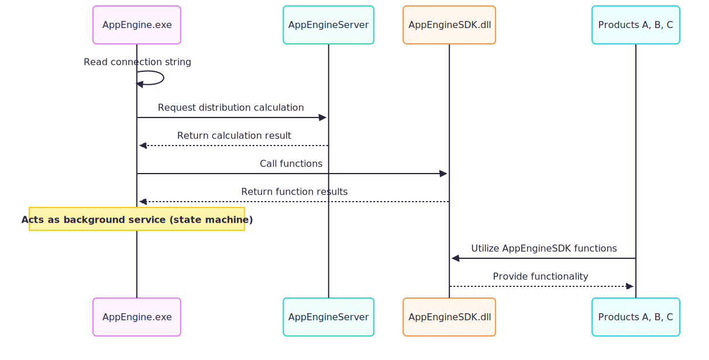
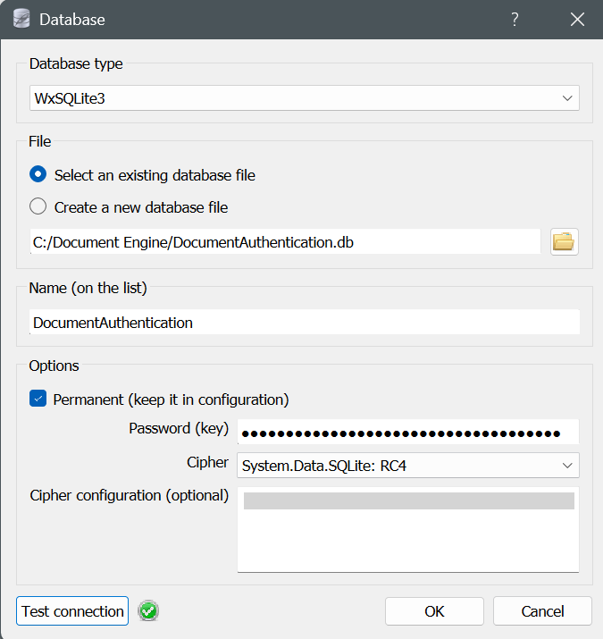
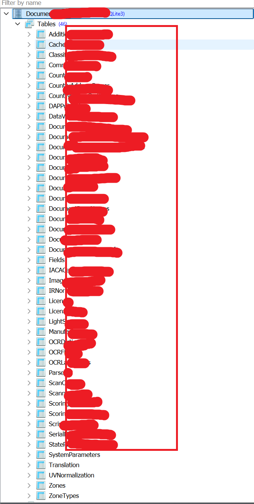

:::CAUTION
This content is for educational purposes only. Sensitive information has been anonymized to comply with ethical and legal standards.
:::

# Series

- [Part 1](./part1.md) Understand the license activation flow
- [Part 2](./part2.md) We write our own keygen
- [Bonus](./part3.md) Bonus , Decryt the connection string for sqlite

# Intro

Before we start , lets complete the pizzel in part 1

The system architecture involving **AppEngine.exe**, **AppEngineServer**, **AppEngineSDK.dll**, and Products **A**, **B**, and **C** :

- Connection String Retrieval: **AppEngine.exe** retrieves a connection string to establish necessary configurations for communication or data access.
- Distribution Calculation: **AppEngine.exe** communicates with AppEngineServer to perform distribution calculations, leveraging server-side processing capabilities.
- Function Invocation: **AppEngine.exe** invokes multiple functions provided by **AppEngineSDK.dll** to execute specific operations critical to the application's functionality.
- Background Service Operation: **AppEngine.exe** operates as a background service, functioning as a state machine to manage processes and maintain system state efficiently.
- Product Integration: Products **A**,**B**, and **C** utilize the functionality provided by **AppEngineSDK.dll**, enabling seamless integration with the application engine's capabilities.

# Reverse

in **AppEngine.exe** in [Part 1](./part1.md),based on the diagram we illustrate we found out **tf** class -> **p** method

```cs
private string p()
	{
		short num = (short)1281359872;
		switch (num)
		{
		default:
		{
			num = (short)1274298795;
			short num2 = num;
			num = (short)1514226091;
			byte[] array;
			switch ((num2 == num) ? 1 : 0)
			{
			case 0:
			case 2:
				break;
			default:
				num = (short)1990524928;
				if (num != 0)
				{
				}
				array = new byte[32];
				try
				{
					tk.GetBytes(array);
					break;
				}
				catch (Exception ex)
				{
					Common.Logger.Logger.Log(Common.Logger.LogLevel.Error, "Error acquiring encryption key: " + ex.Message, null);
					return null;
				}
				goto IL_00CA;
			}
			string text = Convert.ToBase64String(array);
			string text2 = "base 64 key 1";
			string text3 = "base 64 key 2";
			Common.Logger.Logger.Log(Common.Logger.LogLevel.Verbose, "Encryption Key Acquired", null);
			AesManaged aesManaged = new AesManaged();
			try
			{
				ICryptoTransform cryptoTransform = aesManaged.CreateDecryptor(Convert.FromBase64String(text), Convert.FromBase64String(text2));
				try
				{
					byte[] array2 = Convert.FromBase64String(text3);
					try
					{
						MemoryStream memoryStream = new MemoryStream();
						try
						{
							CryptoStream cryptoStream = new CryptoStream(memoryStream, cryptoTransform, CryptoStreamMode.Write);
							try
							{
								cryptoStream.Write(array2, 0, array2.Length);
								cryptoStream.FlushFinalBlock();
								memoryStream.Position = 0L;
								text3 = Encoding.Unicode.GetString(memoryStream.ToArray());
							}
							finally
							{
								num = (short)1429078016;
								int num3 = (int)((IntPtr)num);
								for (;;)
								{
									switch (num3)
									{
									case 0:
										switch (0)
										{
										case 0:
											goto IL_01C4;
										}
										continue;
									case 1:
										((IDisposable)cryptoStream).Dispose();
										num = (short)2005663746;
										num3 = (int)((IntPtr)num);
										continue;
									case 2:
										goto IL_01FC;
									}
									IL_01C4:
									if (cryptoStream == null)
									{
										break;
									}
									num = (short)140247041;
									num3 = (int)((IntPtr)num);
								}
								IL_01FC:;
							}
						}
						finally
						{
							num = (short)2046099456;
							int num3 = (int)((IntPtr)num);
							for (;;)
							{
								switch (num3)
								{
								case 0:
									switch (0)
									{
									case 0:
										goto IL_0233;
									}
									continue;
								case 1:
									((IDisposable)memoryStream).Dispose();
									num = (short)423821314;
									num3 = (int)((IntPtr)num);
									continue;
								case 2:
									goto IL_026B;
								}
								IL_0233:
								if (memoryStream == null)
								{
									break;
								}
								num = (short)2131492865;
								num3 = (int)((IntPtr)num);
							}
							IL_026B:;
						}
						goto IL_00CA;
					}
					catch
					{
						Common.Logger.Logger.Log(Common.Logger.LogLevel.Error, "Invalid Encryption Key", null);
						goto IL_00CA;
					}
				}
				finally
				{
					num = (short)2089484288;
					int num3 = (int)((IntPtr)num);
					for (;;)
					{
						switch (num3)
						{
						case 0:
							switch (0)
							{
							case 0:
								goto IL_02B7;
							}
							continue;
						case 1:
							cryptoTransform.Dispose();
							num = (short)454230018;
							num3 = (int)((IntPtr)num);
							continue;
						case 2:
							goto IL_02F0;
						}
						IL_02B7:
						if (cryptoTransform == null)
						{
							break;
						}
						num = (short)2135621633;
						num3 = (int)((IntPtr)num);
					}
					IL_02F0:;
				}
			}
			finally
			{
				num = (short)2091646976;
				int num3 = (int)((IntPtr)num);
				for (;;)
				{
					switch (num3)
					{
					case 0:
						switch (0)
						{
						case 0:
							goto IL_0325;
						}
						continue;
					case 1:
						((IDisposable)aesManaged).Dispose();
						num = (short)591265794;
						num3 = (int)((IntPtr)num);
						continue;
					case 2:
						goto IL_035D;
					}
					IL_0325:
					if (aesManaged == null)
					{
						break;
					}
					num = (short)1612185601;
					num3 = (int)((IntPtr)num);
				}
				IL_035D:;
			}
			string text4;
			return text4;
			IL_00CA:
			num = (short)1102970881;
			if (num != 0)
			{
			}
			num = (short)771883008;
			short num4 = num;
			Common.Logger.Logger.Log(Common.Logger.LogLevel.Verbose, "Database Key Decrypted", null);
			return text3;
		}
		}
	}
```

```cs
internal static class tk
{
	// Token: 0x060000EF RID: 239
	[DllImport("EngineServer.dll", CallingConvention = CallingConvention.Cdecl, CharSet = CharSet.Ansi)]
	public static extern int GetBytes(byte[] A_0);

	// Token: 0x040000A1 RID: 161
	[NonSerialized]
	private string l = "";
}

```

Now , we add a breakpoint to **return text3** , go to dnspy **locals** windows ,
we can got the connection
by below C# code we can got the same thing

```cs

using System.Runtime.InteropServices;
using System.Security.Cryptography;
using System.Text;
Console.WriteLine(GetDecryptedKey());
Console.Read();
[DllImport("AppServer.dll", CallingConvention = CallingConvention.Cdecl, CharSet = CharSet.Ansi)]
static extern int GetBytes(byte[] A_0);
static string GetDecryptedKey()
{
    byte[] key = new byte[32];
    try
    {
    }
    catch (Exception ex)
    {
        return null;
    }

    string ivBase64 = "base 64 string 1";
    string encryptedBase64 = "base 64 string 2";

    try
    {
        using (var aes = new AesManaged())
        {
            aes.Key = key;
            aes.IV = Convert.FromBase64String(ivBase64);

            ICryptoTransform decryptor = aes.CreateDecryptor();
            byte[] encryptedBytes = Convert.FromBase64String(encryptedBase64);

            using (MemoryStream ms = new MemoryStream())
            using (CryptoStream cs = new CryptoStream(ms, decryptor, CryptoStreamMode.Write))
            {
                cs.Write(encryptedBytes, 0, encryptedBytes.Length);
                cs.FlushFinalBlock();
                return Encoding.Unicode.GetString(ms.ToArray());
            }
        }
    }
    catch (Exception ex)
    {
        return null;
    }
}

```

# Result

Now by using **SqliteSutdio** , click **connect** , Database Type we select **WxSqlite3** , then options password input the connection string we found
Settings as follow

:::Tip
Clipher we use System.Data.Sqlite , since in .net System.Data.Sqlite cliper lib is needed to pay , so we dont write our own code to dump it.
:::
Schemas we got finally


# Whats Next

We will discuess what this application do , why they aritecture like this.
